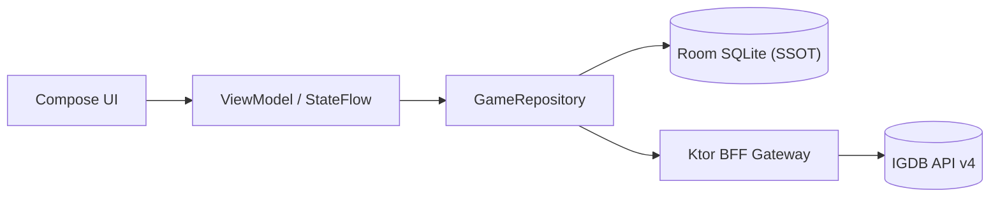

<div align="center">

# GameTracker

**Современное оффлайн-ориентированное Android-приложение (2026) для каталогизации видеоигр и персонального трекинга с companion микросервисом на Kotlin/Ktor.**

[](https://github.com/TypeNil/game-tracker-app/actions/workflows/ci.yml)
[](https://kotlinlang.org/)
[](https://developer.android.com/jetpack/compose)
[](docs/ARCHITECTURE.md)
[](LICENSE)

<br/>


*Критический путь: лента рекомендаций Discover $\rightarrow$ дебаунс-поиск с автодополнением $\rightarrow$ карточка игры с метаданными и скриншотами.*

</div>

---

## ⚡ Быстрый запуск демо (Quick Demo)

Готовый предсобранный APK с автономными оффлайн-фикстурами (не требует ключей API и бэкенда):

```bash
# 1. Скачайте официальный демо-релиз
curl --fail --location --output app-demo.apk https://github.com/TypeNil/game-tracker-app/releases/download/v1.0.0/GameTracker-v1.0.0-demo.apk

# 2. Установите и запустите на подключенном устройстве или эмуляторе
adb install -r app-demo.apk && adb shell monkey -p io.github.typenil.gametracker.demo.debug -c android.intent.category.LAUNCHER 1
```

*Сборка из исходников: `./gradlew :app:installDemoDebug`.*

---

## 🛠️ Что демонстрирует проект (Engineering Highlights)

- **Offline-First и Room SSOT**: Реактивный источник правды на базе Room SQLite (схема `v6`, миграции `1→2→3→4→5→6`). UI наблюдает `Flow<List<Game>>` из репозитория; сетевые обновления атомарно фиксируются в транзакциях Room.
- **Paging 3 + RemoteMediator**: Плавная пагинация с плотной индексацией (`dense ordinals`) в кросс-таблицах, валидацией кэша и корректным оффлайн-восстановлением.
- **Безопасный BFF на Kotlin/Ktor**: Секреты OAuth2 никогда не попадают в мобильный клиент. Серверный rate limiter ($\le 3.33\text{ req/s}$) и single-flight in-memory кэш защищают квоты внешнего IGDB API.
- **Нативные рекомендации на устройстве**: Детерминированный эвристический скоринг по жанрам, темам и платформам на основе библиотечных сигналов пользователя с формированием объяснений ранжирования.
- **Jetpack Compose Production UI**: Material 3 токены, adaptive layouts, предиктивные анимации переходов и кастомный просмотрщик скриншотов с арбитражем жестов (pinch-to-zoom, pan bounds).
- **Фоновые процессы на WorkManager**: Периодическая проверка дат релизов отслеживаемых игр с учетом сетевых ограничений, дедупликацией уведомлений и типизированными Deep Links (`gametracker://game/{id}`).

---

## 📱 Скриншоты

| Лента Discover | Поиск в каталоге | Карточка игры |
| :---: | :---: | :---: |
|  |  |  |

| Библиотека | Чарты и релизы | Просмотр скриншотов |
| :---: | :---: | :---: |
|  |  |  |

---

## 🏛️ Архитектура

Приложение следует принципам **Unidirectional Data Flow (UDF)** и строгого разделения ответственности:



> 📖 Подробная системная диаграмма, sequence flow пагинации, разделение моделей (DTO $\leftrightarrow$ Entity $\leftrightarrow$ Domain) и организация пакетов описаны в [**docs/ARCHITECTURE.md**](docs/ARCHITECTURE.md).

---

## 🔀 Режимы сборки: Demo vs. Live

| Параметр | `demo` флейвор (По умолчанию) | `live` флейвор |
| :--- | :--- | :--- |
| **Источник данных** | Автономные локальные фикстуры | Ktor BFF по HTTP |
| **Ключи API** | Не требуются (Zero configuration) | IGDB Client ID и Secret |
| **Сеть** | Не требуется (работает в режиме полёта) | Требуется подключение к BFF |
| **Назначение** | Презентация портфолио, тесты, быстрый запуск | Исследование полного каталога IGDB |

> 📖 Пошаговое руководство по запуску сервиса Ktor, конфигурации переменных окружения и настройке сети Android (`localhost`, `10.0.2.2`, LAN IP, `adb reverse`) доступно в [**docs/LOCAL_BFF_SETUP.md**](docs/LOCAL_BFF_SETUP.md).

---

## 🧪 Тестирование и CI/CD

В проекте настроен автоматический CI-пайплайн на GitHub Actions из **3 параллельных задач** на каждый PR и push в `main`:
1. **Backend**: `:backend:detekt` $\rightarrow$ `:backend:check` $\rightarrow$ `:backend:build`.
2. **Android**: `:app:detekt` $\rightarrow$ `testDemoDebugUnitTest` $\rightarrow$ `assembleDemoDebug` $\rightarrow$ `assembleLiveDebug` $\rightarrow$ верификация R8.
3. **Инструментальные тесты**: `:app:connectedDemoDebugAndroidTest` на эмуляторе API 30 (тесты DAO Room, `MigrationTest`, `OfflineAcceptanceTest`, Compose UI).

### Команды локальной проверки качества:
```bash
# Статический анализ Detekt (0 замечаний):
./gradlew :app:detekt :backend:detekt

# Unit-тесты Android и бэкенда:
./gradlew :app:testDemoDebugUnitTest :backend:check
```

---

## ⚖️ Инженерные решения и компромиссы

- **Package-by-Feature внутри единого `:app` вместо преждевременного мультимодуля (ADR-010)**:  
  Разделение по пакетам (`core/model`, `core/database`, `core/data`, `feature/*`) обеспечивает чистоту связей, исключая штраф Gradle на конфигурацию десятка модулей. Границы слоёв поддерживаются соглашениями структуры и code review.
- **Локальный кэш Caffeine вместо Redis**:  
  Для одноинстансного BFF-сервиса кэширование в оперативной памяти процесса обеспечивает микросекундный доступ без накладных расходов на развёртывание внешней инфраструктуры.
- **Воспроизведение видео через системный Intent**:  
  Делегирование запуска трейлеров нативному приложению YouTube через Intent экономит ресурсы памяти смартфона и исключает интеграцию тяжеловесных WebView/видеоплееров.

---

## 📚 Документация (Deep Dives)

- [**docs/ARCHITECTURE.md**](docs/ARCHITECTURE.md) — Системная диаграмма, sequence диаграмма пагинации, Room SSOT, миграции схемы v1..v6 и организация слоёв.
- [**docs/LOCAL_BFF_SETUP.md**](docs/LOCAL_BFF_SETUP.md) — Запуск сервиса Ktor, ключи IGDB, привязка `0.0.0.0` vs `127.0.0.1`, `adb reverse` и сети Android.
- [**docs/SECURITY.md**](docs/SECURITY.md) — Модель угроз, жизненный цикл токенов OAuth2, SmoothRateLimiter, защита от APICalypse-инъекций и гигиена логов.
- [**docs/RECOMMENDATIONS.md**](docs/RECOMMENDATIONS.md) — Точная формула эвристического движка, веса сигналов библиотеки, байесовское сглаживание и генерация объяснений.
- [**docs/DEMO_SCENARIOS.md**](docs/DEMO_SCENARIOS.md) — Интерактивные adb-сценарии: тестовое уведомление (`ACTION_TEST_NOTIFICATION`), Deep Links, WorkManager и оффлайн-проверка.

---

## 📄 Лицензия и атрибуция

- Каталог игр, обложки и метаданные предоставлены [IGDB.com](https://www.igdb.com/) (Twitch Interactive).
- Исходный код распространяется под открытой лицензией [MIT License](LICENSE).
