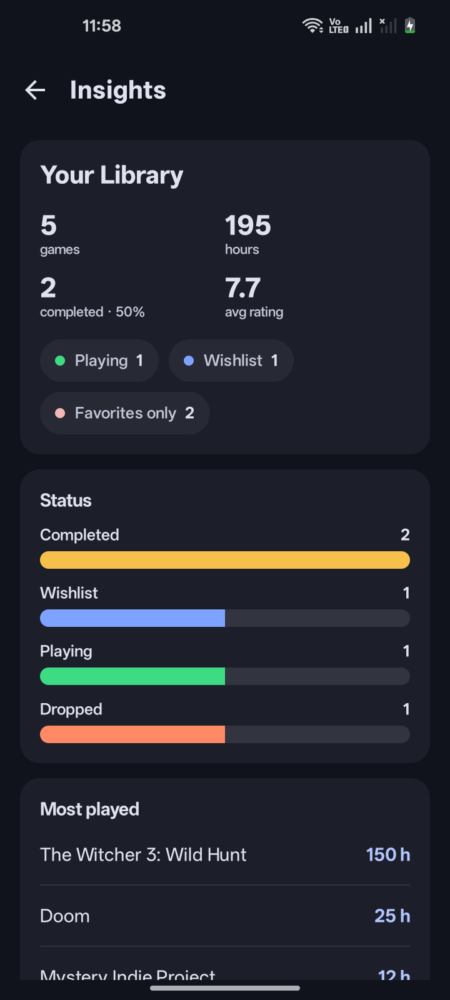
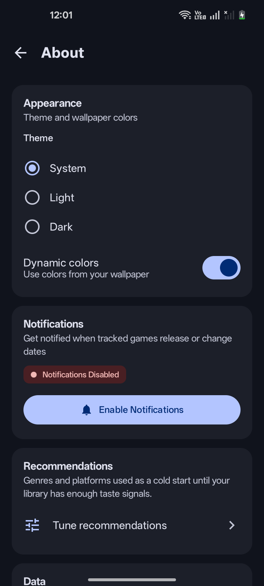
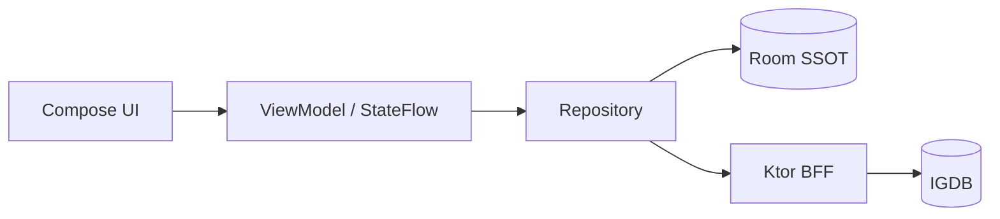

<div align="center">

# GameTracker

Android-приложение для поиска игр, ведения личной библиотеки, отслеживания прогресса и персональных рекомендаций.

Kotlin · Jetpack Compose · offline-first · Room / Paging 3 · Ktor BFF

[](https://github.com/TypeNil/game-tracker-app/actions/workflows/ci.yml)
[](https://github.com/TypeNil/game-tracker-app/releases/latest)
[](LICENSE)


**[Скачать demo APK (v1.0.3)](https://github.com/TypeNil/game-tracker-app/releases/download/v1.0.3/GameTracker-v1.0.3-demo.apk)**
· [Релиз](https://github.com/TypeNil/game-tracker-app/releases/tag/v1.0.3)

Signed `demoRelease`, оффлайн, без API-ключей. Портфолио-сборка, не Play-релиз.

</div>

## Возможности

- **Discover** — персональные рекомендации For You с настройкой холодного старта, чарты и предстоящие релизы
- **Поиск** — отдельная вкладка нижней навигации с каталогом, фильтрами (жанр, платформа, рейтинг, год) и историей запросов
- **Карточка игры** — метаданные, скриншоты, похожие игры, share и трейлер во внешнем плеере
- **Библиотека** — Playing / Completed / Wishlist / Dropped / Not Interested, оценка 1–10, часы, заметки, избранное и Library Insights
- **Резервная копия** — экспорт и импорт библиотеки через Android Storage Access Framework в versioned JSON (merge / replace)
- **Уведомления** — явная настройка напоминаний о релизе для каждой игры и deep link на карточку
- **Developer tools** — debug-only seed / wipe / diagnostics для быстрой проверки сценариев; в release APK инструментов нет
- **Внешний вид** — System / Light / Dark и dynamic color на поддерживаемых устройствах
- **Языки** — английский и русский

## Стек

| Слой | Технологии |
| :--- | :--- |
| UI | Kotlin, Jetpack Compose, Material 3 |
| Состояние | ViewModel, UDF, Coroutines / Flow |
| Данные | Room, Paging 3 / RemoteMediator |
| Сеть | Retrofit, OkHttp, kotlinx.serialization |
| DI / фон | Hilt, WorkManager |
| Backend | Ktor BFF (прокси IGDB) |
| Качество | Detekt, Android Lint, unit / instrumentation / CI |

## Скриншоты

| Discover / For You | Search |
| :---: | :---: |
|  |  |

| Library | Library Insights |
| :---: | :---: |
|  |  |

<details>
<summary>Карточка игры, настройки, чарты и просмотр скриншотов</summary>

| Game details | Settings |
| :---: | :---: |
|  |  |

| Popular & charts | Media viewer |
| :---: | :---: |
|  |  |

</details>

## Что интересно в инженерии

- **Offline-first / Room SSOT.** UI читает `Flow` из Room. Сеть пишет в базу, не в экран — ранее загруженные данные каталога и библиотека остаются доступны без сети.
- **Paging 3 + RemoteMediator.** Поиск использует Paging 3 поверх Room с `RemoteMediator`; Discover-ленты также кэшируются в Room и поддерживают постраничную догрузку.
- **Coroutines / Flow.** UDF: состояние вниз, события вверх. Поиск отменяет устаревшие запросы.
- **Ktor BFF.** Секреты IGDB остаются на сервере; live-клиент работает с IGDB только через BFF.
- **WorkManager.** Фоновая сверка дат релиза работает только для игр, где пользователь включил уведомления, и остаётся best-effort.
- **SAF backup.** Экспорт и импорт проходят через системный Storage Access Framework; versioned JSON и транзакционный Room import не требуют filesystem permissions.
- **Тесты и CI.** Detekt, Android Lint, unit, Room-миграции, instrumentation/Compose и R8 — на каждый PR.

## Архитектура



- UDF: UI рисует `UiState`, в сеть сам не ходит.
- Room — постоянный источник правды для каталога и библиотеки.
- Repository стыкует локальный кэш и BFF.
- В UI только domain-модели, не network DTO.

Подробности: [docs/ARCHITECTURE.md](docs/ARCHITECTURE.md).

## Демо и запуск

Оффлайн APK, package `io.github.typenil.gametracker.demo`:

```bash
curl --fail --location --output app-demo.apk \
  https://github.com/TypeNil/game-tracker-app/releases/download/v1.0.3/GameTracker-v1.0.3-demo.apk
adb install -r app-demo.apk
adb shell monkey -p io.github.typenil.gametracker.demo -c android.intent.category.LAUNCHER 1
```

```bash
./gradlew :app:installDemoDebug    # оффлайн demo
./gradlew :app:installLiveDebug    # каталог IGDB через локальный BFF
```

`live` — локальный Ktor BFF и ключи IGDB: [docs/LOCAL_BFF_SETUP.md](docs/LOCAL_BFF_SETUP.md). Публичный backend не развёрнут.

## Тесты и CI

На PR и `main`: Detekt (`:app`, `:backend`), Android Lint, unit-тесты Android и backend, Room-миграции, instrumentation / Compose UI, API smoke миграций на API 26 и 36, сборки `demo` / `live`, R8 (unsigned в CI; signed demo — portfolio-release).

```bash
./gradlew :app:detekt :backend:detekt
./gradlew :app:testDemoDebugUnitTest :backend:check
```

## Инженерные решения

- **Один модуль `:app`, package-by-feature.** Слои (`core/model`, `core/database`, `core/data`, `feature/*`) — соглашениями пакетов, без десятка Gradle-модулей «на вырост».
- **Caffeine, не Redis.** BFF одноинстансный: кэш в процессе закрывает повторные запросы к IGDB без лишней инфраструктуры.
- **Трейлер через системный Intent.** Плеер на устройстве уже есть; в APK нет WebView.

<details>
<summary>Ограничения</summary>

- **For You в `live`:** ranking на устройстве, кандидаты с BFF; лента в памяти и не переживает смерть процесса.
- **BFF:** локальный прокси без клиентской аутентификации. Публичный backend не развёрнут.
- **Уведомления о релизе:** best-effort, не гарантия доставки; отслеживаются только игры с включённым пользовательским переключателем.
- **Developer tools:** доступны только в debug-вариантах и не входят в подписанный portfolio release.
- **Backup:** записи библиотеки могут попасть в Android cloud backup / device transfer; экспорт через SAF создаёт отдельный JSON-файл.

</details>

## Документация

- [Architecture](docs/ARCHITECTURE.md) — слои, Room SSOT, пагинация
- [Local BFF](docs/LOCAL_BFF_SETUP.md) — запуск Ktor и ключи IGDB
- [Security](docs/SECURITY.md) — OAuth, квоты IGDB, логи
- [Recommendations](docs/RECOMMENDATIONS.md) — эвристика For You
- [Demo signing](docs/DEMO_RELEASE_SIGNING.md) — подпись `demoRelease`
- [Demo scenarios](docs/DEMO_SCENARIOS.md) — deep links, уведомления, оффлайн и debug-инструменты

## Лицензия и атрибуция

Каталог, обложки и метаданные — [IGDB.com](https://www.igdb.com/) (Twitch Interactive). Код — [MIT License](LICENSE).
