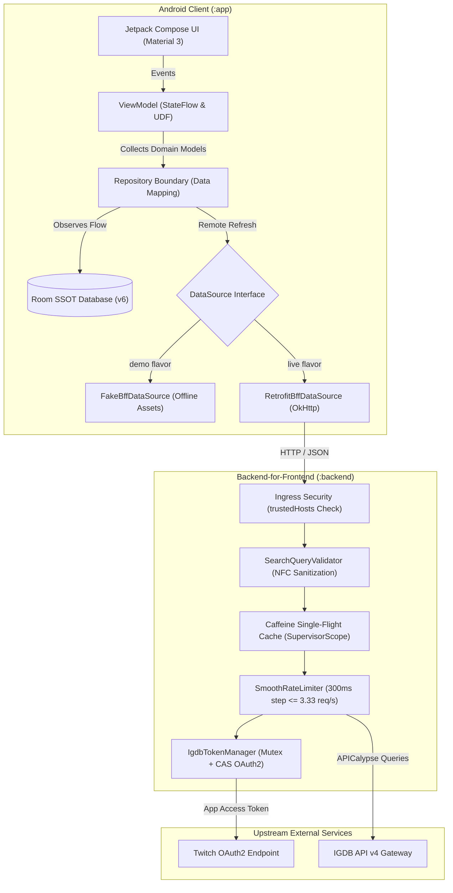

# GameTracker

<div align="center">

[](https://github.com/TypeNil/game-tracker-app/actions/workflows/ci.yml)
[](https://kotlinlang.org)
[](https://developer.android.com/jetpack/compose)
[](https://m3.material.io)
[](https://developer.android.com/training/data-storage/room)
[](https://ktor.io)
[](https://developer.android.com/about/dashboards)
[](https://developer.android.com)
[](LICENSE)

**Production-grade Android application (2026) with companion Kotlin/Ktor Backend-for-Frontend (BFF) proxying the IGDB API.**  
Engineered with Unidirectional Data Flow (UDF), Room Single Source of Truth (SSOT), smooth rate limiting, and an offline demo flavor.

[5-Minute Tour](#-5-minute-executive-tour) • [Quick Demo](#-quick-demo) • [Architecture](#-architecture-overview) • [Screenshots](#-screenshots) • [BFF Setup](#-live-local-bff-setup) • [Security](#-security-architecture--threat-model)

---

</div>

## ⏱️ 5-Minute Executive Tour

GameTracker is an architectural portfolio project demonstrating production-readiness in modern Android engineering:

- **True Offline-First Architecture**: Room Database (schema `v6`, migrations `1→2→3→4→5→6`) serves as the strict Single Source of Truth. The UI observes repository-provided `Flow<List<Game>>` and `Flow<PagingData<Game>>`; Room entities remain encapsulated in the data layer. Remote data updates Room; the UI reactively updates from Room.
- **Zero-Secret Client & Production BFF**: Mobile binaries never store Twitch OAuth2 credentials. The Kotlin/Ktor 3 BFF service manages the token lifecycle, prevents burst quota violations on IGDB via a monotonic `SmoothRateLimiter` ($\le 3.33\text{ req/s}$), and eliminates request dogpiling with a Caffeine single-flight cache.
- **Modern Jetpack Compose UI**: Built with Material 3 tokens, strong skipping mode, a custom gesture-arbitrated zoomable screenshot viewer (pinch-to-zoom 1x..4x with aspect-ratio bounded panning), and responsive empty/skeleton states.
- **Personalized Recommendations**: Transparent heuristic engine extracting genre/theme preference vectors from user library signals (Playing, Completed, Wishlist, Dropped, User Rating) with human-readable rationale tags (*"Because you enjoyed Cyberpunk 2077"*).
- **Dual Flavor Delivery**: `demo` (100% self-contained offline fixtures with bundled high-res assets) and `live` (connected to the Ktor BFF).

---

## 🎬 Critical Flow Walkthrough

<div align="center">


*Critical flow: Discover Feed with personalized recommendations → Debounced Search → Game Details with rich metadata and video trailer → Personal Library tracking.*

</div>

---

## 🚀 Quick Demo

Run the application immediately with zero API keys or backend setup.

### Option A: Install Prebuilt Demo APK (2 Commands)

```bash
curl --fail --location --output GameTracker-v1.0.0-demo.apk \
  https://github.com/TypeNil/game-tracker-app/releases/download/v1.0.0/GameTracker-v1.0.0-demo.apk

adb install -r GameTracker-v1.0.0-demo.apk \
  && adb shell am start -n io.github.typenil.gametracker.demo.debug/io.github.typenil.gametracker.MainActivity
```

### Option B: Build and Run from Source

```bash
./gradlew :app:assembleDemoDebug
adb install -r app/build/outputs/apk/demo/debug/app-demo-debug.apk \
  && adb shell am start -n io.github.typenil.gametracker.demo.debug/io.github.typenil.gametracker.MainActivity
```

> **Signature Troubleshooting**: The prebuilt demo APK is signed with the standard Android debug certificate for frictionless evaluation. If a previous build with a different debug key was installed on your device, reinstall with:  
> `adb uninstall io.github.typenil.gametracker.demo.debug && adb install -r GameTracker-v1.0.0-demo.apk`

---

## 🏛️ Architecture Overview

The project adheres to Clean Architecture and Unidirectional Data Flow (UDF) principles with explicit layer and package boundaries.

### High-Level System Architecture



### Data Flow & Security Pipeline

```mermaid
sequenceDiagram
    autonumber
    participant UI as Compose Screen
    participant VM as ViewModel
    participant Repo as GameRepository
    participant DB as Room Database (v6)
    participant BFF as Ktor BFF Gateway
    participant IGDB as IGDB API

    UI->>VM: User opens Discover feed
    VM->>Repo: Observe getTopRatedGamesFlow()
    Repo->>DB: query SearchDao (SELECT cached games)
    DB-->>Repo: Flow<List<SearchResultCrossRef>>
    Repo-->>VM: Flow<List<Game>> (Mapped to Domain)
    VM-->>UI: DiscoverUiState.Content

    rect rgb(30, 45, 60)
    Note over VM,BFF: Background Refresh / RemoteMediator
    VM->>Repo: refreshTopRatedGames(limit, offset)
    Repo->>BFF: GET /v1/discover/top-rated?limit=20&offset=0
    BFF->>BFF: Cache check (Single-Flight CompletableDeferred)
    alt Cache Miss
        BFF->>BFF: SmoothRateLimiter.acquire()
        BFF->>IGDB: POST /v4/games (APICalypse body)
        IGDB-->>BFF: 200 OK (Upstream DTOs)
        BFF->>BFF: Populate Caffeine cache (TTL 60 min)
    end
    BFF-->>Repo: 200 OK (GameDto list)
    Repo->>DB: Room Transaction: Upsert games & CrossRef
    DB-->>Repo: Invalidation Tracker triggers Flow emit
    Repo-->>VM: Updated Flow<List<Game>>
    VM-->>UI: Recomposed UI with latest data
    end
```



---

## ✨ Features

### Android Client (`:app`)
- **Discover & Charts**: Personalized "For You" recommendations, Popular Upcoming countdowns, and Top-Rated charts with infinite scrolling.
- **Fast Debounced Search**: 300 ms debouncing, instant cancellation of in-flight coroutine jobs, and query history persistence in Room.
- **Rich Game Details**: High-resolution covers, metadata tags (genres, themes, platforms, developers/publishers), rating badges, media carousels, similar games graph, and external trailer playback.
- **Interactive Screenshot Viewer**: Fullscreen gesture viewer with pinch-to-zoom (1x..4x), double-tap zoom (1x $\leftrightarrow$ 2.5x), and dynamic pan bounds constrained to the actual fitted image aspect ratio.
- **Personal Library**: 5 status tiers (*Playing, Completed, Wishlist, Dropped, Not Interested*), 1–10 rating scrubber with semantic tiers, personal notes preview, and Quick Hours stepper dialog with session delta tracking.
- **Background Release Notifications**: Periodic background tracking via WorkManager, notification channels, Android 13+ runtime permissions, and type-safe deep linking (`gametracker://game/{id}`).
- **Internationalization**: Full English and Russian localization with locale-aware date formatting.

### Ktor BFF Service (`:backend`)
- **OAuth2 Token Management**: Thread-safe token acquisition and atomic CAS invalidation on upstream HTTP 401.
- **Monotonic Rate Limiter**: 300 ms strict step ($\le 3.33\text{ req/s}$) mathematically eliminating burst violations against IGDB's 4 req/s limit.
- **Single-Flight Cache**: Application-scoped `SupervisorScope` with `CompletableDeferred` preventing duplicate in-flight requests and isolating client disconnections.
- **APICalypse Injection Guard**: Strict NFC Unicode validator (1..100 characters, allowlist) sanitizing user search input.
- **Ingress Security**: Validates direct socket peer (`local.remoteHost`) against `trustedHosts` before trusting `X-Forwarded-For`.

---

## 📱 Screenshots

| Discover Feed | Upcoming & Charts | Real-time Search |
| :---: | :---: | :---: |
|  |  |  |

| Game Details | User Library | Zoomable Screenshot Viewer |
| :---: | :---: | :---: |
|  |  |  |

---

## 🔀 Build Variants: Demo vs. Live

| Capability / Property | `demo` Flavor (Default) | `live` Flavor |
| :--- | :--- | :--- |
| **Data Source** | `FakeBffDataSource` (bundled offline assets) | `RetrofitBffDataSource` (Ktor BFF over HTTP) |
| **External Credentials** | **None** (Zero configuration) | Twitch Client ID & Client Secret |
| **Offline Independence** | **100% autonomous** (works in Airplane Mode) | Requires reachable Ktor service |
| **Media Assets** | High-res covers & screenshots in `demo/assets/` | Remote CDN URLs from IGDB |
| **Target Use Case** | Portfolio evaluation, fast CI, automated tests | Real-time full IGDB catalog exploration |
| **Application ID** | `io.github.typenil.gametracker.demo.debug` | `io.github.typenil.gametracker.debug` |

---

## 🛠️ Live Local BFF Setup

To explore the live IGDB catalog through your own proxy:

### 1. Register Twitch Developer Credentials
Obtain a Client ID and Client Secret at the [Twitch Developer Console](https://dev.twitch.tv/console/apps).

### 2. Start the Ktor BFF Service

```bash
export TWITCH_CLIENT_ID="your_client_id"
export TWITCH_CLIENT_SECRET="your_client_secret"
./gradlew :backend:run
```

The service will start at `http://127.0.0.1:8080/`. Confirm readiness with:
```bash
curl http://127.0.0.1:8080/health
# {"status":"ok","version":"1.0.0"}
```

### 3. Connect the Android Client

#### Network Contexts Explained:
- **`localhost` (`127.0.0.1`)**: Refers to the loopback interface of the *Android device itself*. Inside an emulator or physical phone, `localhost` does **not** point to your development PC.
- **`10.0.2.2` (Android Emulator)**: Special virtual router alias provided by QEMU that routes directly to `127.0.0.1` on your host PC. This is the default base URL for the `live` debug flavor.
- **`adb reverse` (Physical USB Device — Recommended)**: Maps device port 8080 to PC port 8080 over USB:
  ```bash
  adb reverse tcp:8080 tcp:8080
  ./gradlew :app:installLiveDebug -PBFF_BASE_URL="http://127.0.0.1:8080/"
  ```
- **LAN IP (Wi-Fi Device)**: Connects directly to host machine on local Wi-Fi:
  ```bash
  ./gradlew :app:installLiveDebug -PBFF_BASE_URL="http://192.168.1.100:8080/"
  ```

---

## 🔒 Security Architecture & Threat Model

<details>
<summary><b>Click to expand security threat model and mitigation details</b></summary>

### Why Client Credentials Must Never Live in Mobile APKs
Reverse-engineering an Android APK with tools like `jadx` or `apktool` trivially recovers embedded API keys and secrets. Packaging Twitch/IGDB OAuth2 Client Credentials inside the mobile app allows unauthorized third parties to extract the credentials, exhaust rate limits, or abuse quotas.

### BFF Security Mitigations
1. **OAuth2 Token Isolation**: The mobile client never receives or handles OAuth2 tokens. The BFF exchanges credentials via HTTP POST (`application/x-www-form-urlencoded`), stores tokens in memory using an `AtomicReference`, and invalidates them automatically upon upstream 401 responses.
2. **Monotonic Rate Limiter**: Upstream IGDB has a hard limit of 4 requests/second. The custom `SmoothRateLimiter` enforces a strict 300 ms interval between requests ($\le 3.33\text{ req/s}$), mathematically preventing burst accumulation at second boundaries.
3. **Single-Flight Cache**: If 10 clients request the same search query simultaneously, the Caffeine cache uses `CompletableDeferred` inside a `SupervisorScope` so only **one** request reaches IGDB. Downstream client cancellations do not cancel the leader calculation.
4. **APICalypse Injection Guard**: User search queries are validated against Unicode NFC normalization and character allowlists (`SearchQueryValidator`) before being interpolated into IGDB query strings.
5. **Ingress Peer Validation**: The BFF verifies the direct TCP socket peer (`local.remoteHost`) against an allowlist of trusted proxies before honoring the `X-Forwarded-For` header, preventing IP-spoofing attacks.
6. **Zero Leakage**: All logs redact sensitive parameters, query strings, and auth tokens. Public error responses are normalized to a sanitized `ErrorResponse` model.

</details>

---

## 💾 Offline-First Architecture & Room SSOT

The application guarantees complete offline functionality through Room Database (SSOT):

- **Data Boundary**: The UI observes repository-provided `Flow<List<Game>>` and `Flow<PagingData<Game>>`. Room entities remain encapsulated in the data layer and are mapped to clean domain models (`Game`) at the repository boundary.
- **Reactive Cache Observation**: Remote network calls never return data directly to the UI. Network responses update Room tables; Room invalidation trackers emit updated data through Flow.
- **Relational Integrity**: User library entries (`library_entries`) reference catalog games (`games`) with `ForeignKey.RESTRICT`. When catalog search caches expire, user-tracked library entries are permanently protected from cascade deletion.
- **Schema Evolution**: Current database schema is `v6`. Database migrations `1→2→3→4→5→6` are fully implemented and verified via automated `MigrationTest` suites.

---

## 🧠 Personalized Recommendations Engine

<details>
<summary><b>Click to expand recommendation heuristic algorithm details</b></summary>

The recommendation engine operates entirely on-device, providing transparent and privacy-preserving recommendations without external tracking servers:

1. **Signal Extraction**: Reads user library entries and assigns affinity weights based on status:
   - Favorite: `+3.0`
   - Playing: `+2.5`
   - Completed: `+2.0`
   - Wishlist: `+1.5`
   - Dropped: `-2.0`
   - Rating multiplier: `(userRating - 5) / 2.5`
2. **Profile Generation**: Aggregates normalized preference vectors across genres, themes, and developer companies.
3. **Candidate Scoring**: Unowned catalog games are scored using:
   $$\text{Score} = (\text{GenreAffinity} \times 0.4) + (\text{ThemeAffinity} \times 0.3) + (\text{CompanyAffinity} \times 0.2) + (\text{RatingScore} \times 0.1)$$
4. **Explainability Engine**: Every recommendation item generates clear, human-readable rationale tags:
   - *"Because you loved RPGs"*
   - *"From the creators of Witcher 3"*
   - *"Top rated in Sci-Fi"*

</details>

---

## 🧪 Testing Strategy & CI/CD Pipelines

The codebase enforces a rigorous quality bar verified through automated GitHub Actions workflows:

### Automated CI Pipeline (3 Parallel Jobs)
1. **Backend Quality**: `:backend:detekt` → `:backend:check` → `:backend:build` → `git diff --exit-code`.
2. **Android Quality & Assembly**: `:app:detekt` → `testDemoDebugUnitTest` → `assembleDemoDebug` → `assembleLiveDebug` → `:app:verifyReleaseArtifacts` (R8 verification).
3. **Connected Instrumentation**: `:app:connectedDemoDebugAndroidTest` on an API 30 emulator (Room DAO suites, `MigrationTest`, `OfflineAcceptanceTest`, and Compose UI tests).

### Quality Verification Commands

- **POSIX (Linux / macOS)**:
  ```bash
  ./gradlew :app:detekt :backend:detekt     # Static analysis (both tasks pass with no findings)
  ./gradlew testDemoDebugUnitTest           # Android unit tests
  ./gradlew :backend:check                  # Backend unit & integration tests
  ```

- **Windows (PowerShell / CMD)**:
  ```powershell
  .\gradlew.bat :app:detekt :backend:detekt
  .\gradlew.bat testDemoDebugUnitTest
  .\gradlew.bat :backend:check
  ```

---

## 🔔 Interactive Verification Demos

### 1. Deterministic Test Notification Demo
To verify the notification delivery and deep linking pipeline:

1. Grant notification permission (required on Android 13+ / API 33+):
   ```bash
   adb shell pm grant io.github.typenil.gametracker.demo.debug android.permission.POST_NOTIFICATIONS
   ```
2. Trigger the deterministic test notification:
   ```bash
   adb shell am start -W \
     -n io.github.typenil.gametracker.demo.debug/io.github.typenil.gametracker.MainActivity \
     -a io.github.typenil.gametracker.ACTION_TEST_NOTIFICATION \
     --el gameId 1020 \
     --es gameName "Doom (2016)"
   ```
3. A notification appears in the system tray. Tapping it triggers deep link `gametracker://game/1020` and navigates directly to Game Details.

### 2. Direct Deep-Link Navigation
Launch the application directly into a specific game details screen:
```bash
adb shell am start -W -a android.intent.action.VIEW -d "gametracker://game/1020" io.github.typenil.gametracker.demo.debug
```

### 3. Background WorkManager Scheduling
In the **Settings** screen, tapping **"Check releases now"** triggers `triggerImmediateCheck()`, exercising background worker constraints, network checks, and Room deduplication.

---

## ⚖️ Engineering Trade-offs & Deliberate Non-Goals

- **Package-by-Feature inside `:app` over Premature Multi-Module (ADR-010)**:  
  Maintaining 0 coupling and clean package boundaries (`core/model`, `core/database`, `core/data`, `feature/*`) inside `:app` achieves modularity benefits without the 5–8 second Gradle configuration penalty and KSP code generation overhead of 10+ separate Gradle modules.
- **Caffeine In-Memory Cache over Redis**:  
  For a single-instance BFF service, Caffeine provides zero-overhead, in-process LRU/W-TinyLFU caching without external infrastructure dependencies.
- **Heuristic Recommendations over ML Models**:  
  Transparent, deterministic, on-device scoring preserves user privacy, requires zero external server inference, and produces explainable rationale tags.
- **Intent-based Video Playback over Embedded Player**:  
  Delegating YouTube trailers to native video apps via Android Intent avoids bundling heavyweight WebView/Player libraries, saving binary size and memory.
- **Local Privacy over Cloud Sync**:  
  User library data, hours played, and personal notes remain 100% on-device in Room SQLite.

---

## 📄 Attribution & License

- **Game Data**: Game information, covers, and metadata are provided by [IGDB.com](https://www.igdb.com) and Twitch under the IGDB Terms of Service.
- **License**: This project is licensed under the [MIT License](LICENSE).
