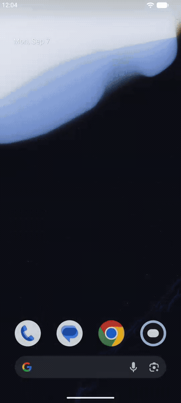
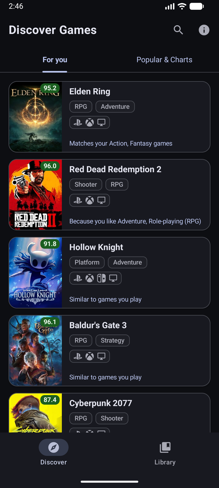
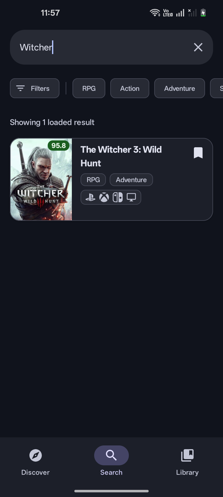
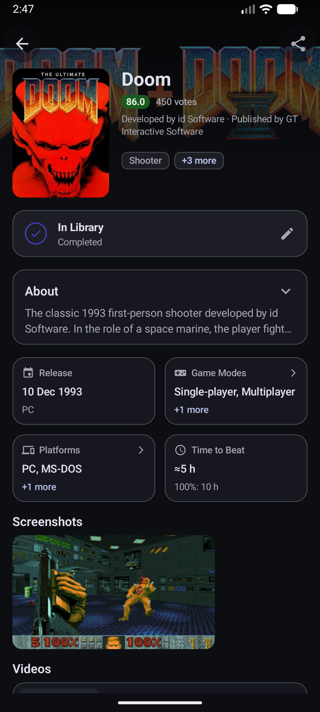
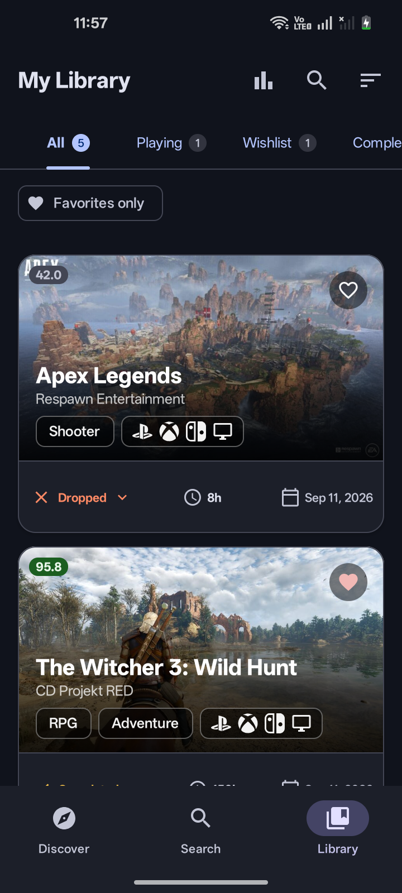
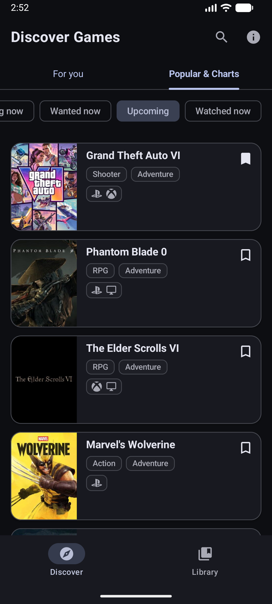
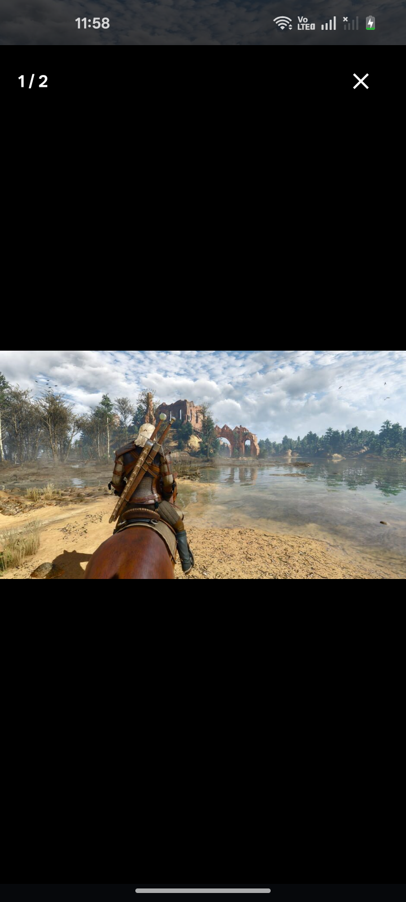
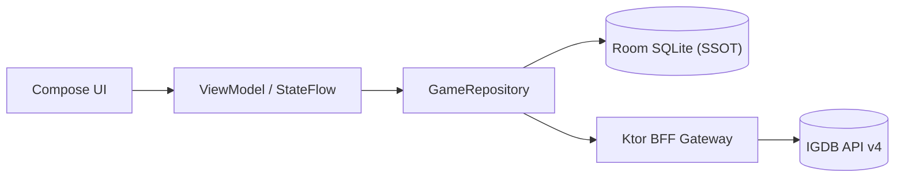

<div align="center">

# GameTracker

Оффлайн-ориентированное Android-приложение для каталогизации видеоигр и персонального трекинга. Каталог IGDB проксирует BFF на Kotlin/Ktor.

[](https://github.com/TypeNil/game-tracker-app/actions/workflows/ci.yml)
[](https://kotlinlang.org/)
[](https://developer.android.com/jetpack/compose)
[](LICENSE)

<br/>



*Критический путь: лента рекомендаций Discover → дебаунс-поиск с автодополнением → карточка игры с метаданными и скриншотами.*

</div>

---

## Быстрый запуск демо

Готовый предсобранный **signed `demoRelease` APK** с автономными оффлайн-фикстурами (не требует ключей API и бэкенда). Package `io.github.typenil.gametracker.demo`, non-debuggable, R8. Это портфолио-сборка, не Play-релиз.

```bash
# 1. Скачайте signed demo APK
curl --fail --location --output app-demo.apk https://github.com/TypeNil/game-tracker-app/releases/download/v1.0.2/GameTracker-v1.0.2-demo.apk

# 2. Установите и запустите на подключенном устройстве или эмуляторе
adb install -r app-demo.apk && adb shell monkey -p io.github.typenil.gametracker.demo -c android.intent.category.LAUNCHER 1
```

*Сборка из исходников: `./gradlew :app:installDemoDebug`. Подпись demoRelease: [docs/DEMO_RELEASE_SIGNING.md](docs/DEMO_RELEASE_SIGNING.md).*

> Скачиваемый demo APK полностью оффлайн. Flavor `live` — только из исходников и рассчитан на локальный BFF (`10.0.2.2`, LAN или `adb reverse`). Публичный production backend для этого портфолио не развёрнут.

---

## Что есть в проекте

- **Offline-First и Room SSOT**: реактивный источник правды на базе Room SQLite (схема `v6`, миграции `1→2→3→4→5→6`). UI наблюдает `Flow<List<Game>>` из репозитория; сетевые обновления атомарно фиксируются в транзакциях Room.
- **Paging 3 + RemoteMediator**: пагинация с плотной индексацией (`dense ordinals`) в кросс-таблицах, валидацией кэша и оффлайн-восстановлением.
- **BFF на Kotlin/Ktor**: секреты OAuth2 не попадают в мобильный клиент. Серверный rate limiter (не более 3.33 req/s) и single-flight in-memory кэш защищают квоты внешнего IGDB API.
- **Рекомендации**: ranking на устройстве по жанрам, темам и платформам. В `live` кандидаты запрашиваются у BFF (seed/exclude IDs и теги, не оценки и заметки). Лента For You не пишется в Room.
- **Jetpack Compose UI**: Material 3 токены, adaptive layouts, предиктивные анимации переходов и просмотрщик скриншотов с арбитражем жестов (pinch-to-zoom, pan bounds).
- **WorkManager**: периодическая best-effort проверка дат релизов с дедупликацией уведомлений и типизированными deep links (`gametracker://game/{id}`). Не at-least-once.

---

## Скриншоты

| Лента Discover | Поиск в каталоге | Карточка игры |
| :---: | :---: | :---: |
|  |  |  |

| Библиотека | Чарты и релизы | Просмотр скриншотов |
| :---: | :---: | :---: |
|  |  |  |

---

## Архитектура

Приложение следует принципам **Unidirectional Data Flow (UDF)** и строгого разделения ответственности:



> Подробная системная диаграмма, sequence flow пагинации, разделение моделей (DTO ↔ Entity ↔ Domain) и организация пакетов описаны в [**docs/ARCHITECTURE.md**](docs/ARCHITECTURE.md).

---

## Режимы сборки: demo и live

| Параметр | `demo` (по умолчанию) | `live` |
| :--- | :--- | :--- |
| **Источник данных** | Автономные локальные фикстуры | Ktor BFF по HTTP |
| **Ключи API** | Не требуются | IGDB Client ID и Secret |
| **Сеть** | Не требуется (работает оффлайн) | Требуется подключение к BFF |
| **Назначение** | Оффлайн-фикстуры, тесты, быстрый запуск | Полный каталог IGDB при локальном BFF |

> `liveDebug` ходит на локальный BFF. `liveRelease` намеренно fail-fast без HTTPS BFF URL и не входит в портфолио-релиз. Пошаговое руководство: [**docs/LOCAL_BFF_SETUP.md**](docs/LOCAL_BFF_SETUP.md).

---

## Тестирование и CI

В проекте настроен CI-пайплайн из **четырёх параллельных задач**:

1. **Backend**: `:backend:detekt` → `:backend:check` → `:backend:build`.
2. **Android**: `:app:detekt` → `testDemoDebugUnitTest` → `assembleDemoDebug` → `assembleLiveDebug`.
3. **Инструментальные тесты**: `:app:connectedDemoDebugAndroidTest` на эмуляторе API 30 (тесты DAO Room, `MigrationTest`, `OfflineAcceptanceTest`, Compose UI).
4. **API smoke**: только `MigrationTest` на API 26 и API 36. Полный connected suite остаётся на API 30.

### Команды локальной проверки

```bash
# Статический анализ Detekt:
./gradlew :app:detekt :backend:detekt

# Unit-тесты Android и бэкенда:
./gradlew :app:testDemoDebugUnitTest :backend:check
```

---

## Инженерные решения и компромиссы

- **Package-by-feature внутри единого `:app` вместо преждевременного мультимодуля**:
  разделение по пакетам (`core/model`, `core/database`, `core/data`, `feature/*`) держит границы слоёв соглашениями структуры и code review, без штрафа Gradle на конфигурацию десятка модулей.
- **Локальный кэш Caffeine вместо Redis**:
  для одноинстансного BFF кэширование в памяти процесса даёт микросекундный доступ без внешней инфраструктуры.
- **Воспроизведение видео через системный Intent**:
  трейлеры открываются нативным приложением YouTube, без WebView и встроенного видеоплеера.

## Ограничения

- **For You (live)**: ranking на устройстве; кандидаты с BFF; лента memory-only и не переживает смерть процесса.
- **BFF**: локальный одноинстансный demo-прокси без клиентской аутентификации. Публичный backend не развёрнут.
- **Уведомления о релизе**: best-effort. WorkManager и дедуп не заменяют durable tracking baseline.
- **Backup**: записи библиотеки могут попасть в Android cloud backup / device transfer.


## Документация

- [**docs/ARCHITECTURE.md**](docs/ARCHITECTURE.md) — системная диаграмма, sequence диаграмма пагинации, Room SSOT, миграции схемы v1..v6 и организация слоёв.
- [**docs/LOCAL_BFF_SETUP.md**](docs/LOCAL_BFF_SETUP.md) — запуск сервиса Ktor, ключи IGDB, привязка `0.0.0.0` vs `127.0.0.1`, `adb reverse` и сети Android.
- [**docs/SECURITY.md**](docs/SECURITY.md) — модель угроз, жизненный цикл токенов OAuth2, SmoothRateLimiter, защита от APICalypse-инъекций и гигиена логов.
- [**docs/DEMO_RELEASE_SIGNING.md**](docs/DEMO_RELEASE_SIGNING.md) — отдельный demo keystore, GitHub Secrets и подпись `demoRelease`.
- [**docs/RECOMMENDATIONS.md**](docs/RECOMMENDATIONS.md) — формула эвристического движка, веса сигналов библиотеки, байесовское сглаживание и генерация объяснений.
- [**docs/DEMO_SCENARIOS.md**](docs/DEMO_SCENARIOS.md) — adb-сценарии: тестовое уведомление (`ACTION_TEST_NOTIFICATION`), deep links, WorkManager и оффлайн-проверка.

---

## Лицензия и атрибуция

- Каталог игр, обложки и метаданные предоставлены [IGDB.com](https://www.igdb.com/) (Twitch Interactive).
- Исходный код распространяется под открытой лицензией [MIT License](LICENSE).
