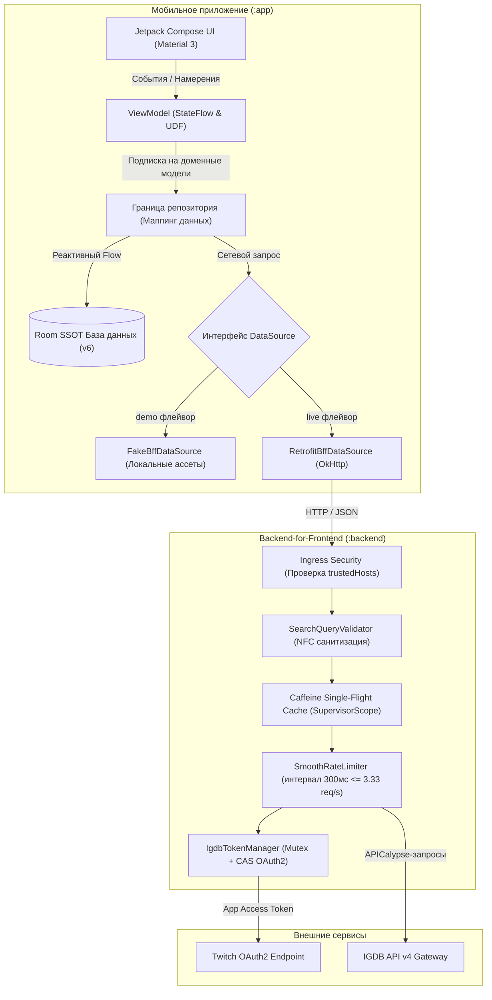

# GameTracker

<div align="center">

[](https://github.com/TypeNil/game-tracker-app/actions/workflows/ci.yml)
[](https://kotlinlang.org)
[](https://developer.android.com/jetpack/compose)
[](https://m3.material.io)
[](https://developer.android.com/training/data-storage/room)
[](https://ktor.io)
[](https://developer.android.com/about/dashboards)
[](https://developer.android.com)
[](LICENSE)

**Нативное Android-приложение (2026) с companion микросервисом BFF на Kotlin/Ktor для работы с IGDB API.**  
Спроектировано по принципам Clean Architecture, Unidirectional Data Flow (UDF), Room Single Source of Truth (SSOT), монотонным rate limiting и автономным demo-режимом.

[5-минутный обзор](#-5-минутный-экспресс-тур) • [Быстрый запуск](#-быстрый-запуск-демо-quick-demo) • [Архитектура](#-архитектурные-диаграммы) • [Скриншоты](#-скриншоты) • [Запуск BFF](#-локальный-запуск-bff-и-сетевое-взаимодействие) • [Безопасность](#-безопасность-и-модель-угроз)

---

</div>

## ⏱️ 5-минутный экспресс-тур

GameTracker — архитектурный портфолио-проект, демонстрирующий стандарты production-разработки под современный Android:

- **Настоящий Offline-First и Room SSOT**: База данных Room (схема `v6`, миграции `1→2→3→4→5→6`) выступает единственным источником правды. UI подписывается на реактивные `Flow<List<Game>>` и `Flow<PagingData<Game>>` из репозитория; Room-сущности инкапсулированы внутри data-слоя. Данные из сети обновляют исключительно Room, а экран реактивно перерисовывается по событиям БД.
- **BFF-шлюз и полная изоляция секретов**: Мобильный клиент никогда не содержит Client ID и Client Secret OAuth2. Сервис на Kotlin/Ktor 3 управляет жизненным циклом токенов, защищает жёсткий upstream-лимит IGDB (4 req/s) с помощью монотонного `SmoothRateLimiter` ($\le 3.33\text{ req/s}$) и предотвращает дублирующие запросы через in-memory кэш Caffeine (single-flight pattern).
- **Современный UI на Jetpack Compose**: Material 3 токены, strong skipping mode, кастомный полноэкранный просмотрщик скриншотов с арбитражем жестов (pinch-to-zoom 1x..4x, double-tap zoom и ограничение панорамирования по реальным пропорциям картинки), анимации переходов и скелетоны загрузки без скачков вёрстки.
- **Персонализированные рекомендации**: Эвристический движок на устройстве рассчитывает вектор предпочтений по жанрам, темам и платформам на основе библиотечных сигналов (*Играю, Пройдено, В планах, Оценка, Избранное*) и формирует теги объяснения с наибольшим вкладом в итоговый скоринг (*«Похоже на игры из вашей библиотеки»*, *«Совпадение по жанру: RPG»*, *«Высокая оценка игроков»*).
- **Два независимых флейвора**: `demo` (100% автономные оффлайн-фикстуры с упакованными постерами высокого разрешения) и `live` (работа через Ktor BFF с реальным каталогом IGDB).

---

## 🎬 Демонстрация ключевого сценария (Critical Flow)

<div align="center">


*Критический путь: лента Discover с рекомендациями → дебаунс-поиск с автодополнением → карточка игры с метаданными и галереей скриншотов.*

</div>

---

## 🚀 Быстрый запуск демо (Quick Demo)

Оцените работу приложения за 1 минуту без регистрации API-ключей и без запуска бэкенда.

### Вариант A: Установка готового Demo APK (2 команды)

```bash
curl --fail --location --output GameTracker-v1.0.0-demo.apk \
  https://github.com/TypeNil/game-tracker-app/releases/download/v1.0.0/GameTracker-v1.0.0-demo.apk

adb install -r GameTracker-v1.0.0-demo.apk \
  && adb shell am start -n io.github.typenil.gametracker.demo.debug/io.github.typenil.gametracker.MainActivity
```

### Вариант B: Сборка и запуск из исходного кода

```bash
./gradlew :app:assembleDemoDebug
adb install -r app/build/outputs/apk/demo/debug/app-demo-debug.apk \
  && adb shell am start -n io.github.typenil.gametracker.demo.debug/io.github.typenil.gametracker.MainActivity
```

> **Примечание по подписи**: Готовый demo APK подписан стандартным Android debug-сертификатом. Если ранее на устройстве была установлена сборка с другим debug-ключом, выполните чистую переустановку:  
> `adb uninstall io.github.typenil.gametracker.demo.debug && adb install -r GameTracker-v1.0.0-demo.apk`

---

## 🏛️ Архитектурные диаграммы

Проект строго следует принципам Clean Architecture и Unidirectional Data Flow (UDF) с изоляцией слоёв и границ пакетов.

### Общая архитектура системы



### Поток данных и конвейер безопасности

```mermaid
sequenceDiagram
    autonumber
    participant UI as Экран Compose
    participant VM as ViewModel
    participant Repo as GameRepository
    participant DB as База данных Room (v6)
    participant BFF as Шлюз Ktor BFF
    participant IGDB as IGDB API v4

    UI->>VM: Пользователь открывает ленту Discover
    VM->>Repo: Запрос getTopRatedGamesFlow()
    Repo->>DB: Запрос в SearchDao (кэшированные игры)
    DB-->>Repo: Flow<List<SearchResultCrossRef>>
    Repo-->>VM: Flow<List<Game>> (Маппинг в домен)
    VM-->>UI: DiscoverUiState.Content

    rect rgb(30, 45, 60)
    Note over VM,BFF: Фоновое обновление / RemoteMediator
    VM->>Repo: refreshTopRatedGames(limit, offset)
    Repo->>BFF: GET /v1/discover/top-rated?limit=20&offset=0
    BFF->>BFF: Проверка in-memory кэша (Single-Flight CompletableDeferred)
    alt Промах кэша
        BFF->>BFF: Ожидание SmoothRateLimiter.acquire()
        BFF->>IGDB: POST /v4/games (APICalypse body)
        IGDB-->>BFF: 200 OK (Upstream DTO)
        BFF->>BFF: Сохранение в кэш Caffeine (TTL 60 мин)
    end
    BFF-->>Repo: 200 OK (Список GameDto)
    Repo->>DB: Транзакция Room: Upsert игр и CrossRef связей
    DB-->>Repo: Трекер инвалидации Room триггерит emit во Flow
    Repo-->>VM: Обновлённый Flow<List<Game>>
    VM-->>UI: Рекомпозиция экрана со свежими данными
    end
```



---

## ✨ Возможности (Features)

### Android-клиент (`:app`)
- **Лента Discover и чарты**: Персонализированные рекомендации «Для вас», подборка самых ожидаемых игр с обратным отсчётом до релиза и топ рейтинга с плавной пагинацией.
- **Мгновенный поиск с дебаунсом**: Дебаунс 300 мс, немедленная отмена устаревших корутин в полёте, фильтрация по жанрам/платформам и сохранение истории поисковых запросов в Room.
- **Подробная карточка игры**: Постеры высокого разрешения, метаданные (жанры, темы, платформы, студии-разработчики и издатели), счётчики оценок, карусель скриншотов, граф похожих игр и запуск официальных трейлеров.
- **Интерактивный просмотрщик скриншотов**: Полноэкранный просмотр с поддержкой pinch-to-zoom (1x..4x), double-tap zoom (1x $\leftrightarrow$ 2.5x) и ограничением панорамирования по реальным границам смасштабированного изображения.
- **Пользовательская библиотека**: 5 статусов (*Играю, Пройдено, В планах, Брошено, Не интересно*), скруббер оценки 1–10 с семантическими категориями, предпросмотр личных заметок и диалог быстрого ввода времени с дельтой текущей игровой сессии.
- **Фоновый трекинг релизов и уведомления**: Периодические проверки релизов через WorkManager с сетевыми ограничениями, поддержка разрешений Android 13+ (`POST_NOTIFICATIONS`), каналы уведомлений и типобезопасные deep links (`gametracker://game/{id}`).
- **Локализация**: Полный перевод интерфейса на русский и английский языки с учётом локали при форматировании дат.

### BFF-микросервис (`:backend`)
- **Управление токенами OAuth2**: Потокобезопасное получение App Access токена через CAS-операции и автоматическая инвалидация при получении upstream HTTP 401.
- **Монотонный Rate Limiter**: Защита лимита IGDB (4 req/s) с фиксированным шагом 300 мс между запросами ($\le 3.33\text{ req/s}$), исключающая всплески на стыке секунд.
- **Single-Flight кэширование**: Изоляция отмены клиентских HTTP-запросов и предотвращение дублирующих запросов к IGDB через `SupervisorScope` и `CompletableDeferred`.
- **Защита от APICalypse-инъекций**: Валидатор поисковых строк (нормализация Unicode NFC, длина 1..100 символов, строгий allowlist).
- **Безопасность ingress**: Проверка непосредственного сокет-пира (`local.remoteHost`) по списку доверенных адресов перед обработкой заголовка `X-Forwarded-For`.

---

## 📱 Скриншоты

| Лента Discover | Чарт релизов и популярного | Поиск в реальном времени |
| :---: | :---: | :---: |
|  |  |  |

| Карточка игры | Библиотека пользователя | Просмотр скриншотов с зумом |
| :---: | :---: | :---: |
|  |  |  |

---

## 🔀 Режимы сборки: Demo vs. Live

| Параметр / Характеристика | `demo` флейвор (По умолчанию) | `live` флейвор |
| :--- | :--- | :--- |
| **Источник данных** | `FakeBffDataSource` (встроенные оффлайн-ассеты) | `RetrofitBffDataSource` (Ktor BFF по HTTP) |
| **Внешние секреты/ключи** | **Не требуются** (Zero configuration) | Twitch Client ID и Client Secret |
| **Автономность без интернета** | **100% автономно** (работает в режиме полёта) | Требует доступный запущенный BFF |
| **Медиа-ресурсы** | Постеры и арты в высоком разрешении в `demo/assets/` | Загрузка с CDN серверов IGDB |
| **Назначение** | Презентация портфолио, быстрый запуск в CI, автотесты | Исследование полного каталога IGDB |
| **Application ID** | `io.github.typenil.gametracker.demo.debug` | `io.github.typenil.gametracker.debug` |

---

## 🛠️ Локальный запуск BFF и сетевое взаимодействие

Если вы хотите подключить мобильное приложение к реальному каталогу IGDB:

### 1. Получите ключи разработчика IGDB (Twitch)
Зарегистрируйте приложение в [Twitch Developer Console](https://dev.twitch.tv/console/apps) и получите Client ID и Client Secret для доступа к IGDB API v4.

### 2. Запустите сервис Ktor BFF

- **Linux / macOS (Bash/Zsh)**:
  ```bash
  export IGDB_CLIENT_ID="ваш_client_id"
  export IGDB_CLIENT_SECRET="ваш_client_secret"
  ./gradlew :backend:run
  ```

- **Windows (PowerShell)**:
  ```powershell
  $env:IGDB_CLIENT_ID = "ваш_client_id"
  $env:IGDB_CLIENT_SECRET = "ваш_client_secret"
  .\gradlew.bat :backend:run
  ```

> **Сетевая привязка (Host Binding) и безопасность**:  
> По умолчанию BFF слушает адрес `0.0.0.0:8080`, поэтому локально он доступен по `http://127.0.0.1:8080`, а также через LAN IP компьютера в домашней сети.  
> Для запуска исключительно на loopback-интерфейсе передайте `HOST=127.0.0.1`:  
> `HOST=127.0.0.1 ./gradlew :backend:run` (POSIX) или `$env:HOST="127.0.0.1"; .\gradlew.bat :backend:run` (Windows).  
> Режим `0.0.0.0` предназначен только для доверенных локальных сетей; при работе в публичных сетях изолируйте порт файрволом или запускайте сервис строго на loopback.

Проверьте готовность сервиса запросом:
```bash
curl http://127.0.0.1:8080/health
# {"status":"ok","version":"1.0.0"}
```

### 3. Подключение Android-клиента

#### Особенности сетей Android:
- **`localhost` (`127.0.0.1`)**: Указывает на loopback-интерфейс *самого Android-устройства*. Из эмулятора или физического телефона `localhost` **не имеет доступа** к вашему компьютеру.
- **`10.0.2.2` (Эмулятор Android)**: Специальный псевдоним виртуального маршрутизатора QEMU, проксирующий трафик на `127.0.0.1` хостового компьютера. Это базовый адрес по умолчанию для `liveDebug`.
- **`adb reverse` (Физическое устройство по USB — Рекомендуется)**: Перенаправляет порт 8080 с телефона на компьютер:
  ```bash
  adb reverse tcp:8080 tcp:8080
  ./gradlew :app:installLiveDebug -PBFF_BASE_URL="http://127.0.0.1:8080/"
  ```
- **LAN IP (Подключение по общей сети Wi-Fi)**: Подключение напрямую по локальному IP-адресу хоста:
  ```bash
  ./gradlew :app:installLiveDebug -PBFF_BASE_URL="http://192.168.1.100:8080/"
  ```

---

## 🔒 Безопасность и модель угроз

<details>
<summary><b>Развернуть подробное описание модели угроз и механизмов защиты</b></summary>

### Почему клиентские секреты категорически запрещено хранить в APK
Декомпиляция Android APK утилитами `jadx` или `apktool` позволяет извлечь любые зашитые строковые константы и токены за считанные секунды. Наличие Twitch/IGDB OAuth2 Client Credentials в открытом коде клиентского приложения приведёт к компрометации квоты и блокировке аккаунта.

### Архитектурные решения безопасности BFF
1. **Изоляция OAuth2**: Клиентское приложение не работает с OAuth2. BFF выполняет POST-запрос формы `application/x-www-form-urlencoded`, хранит токен в оперативной памяти с использованием `AtomicReference` и автоматически инвалидирует его при получении ответа 401.
2. **Монотонный Rate Limiter**: IGDB накладывает жёсткое ограничение в 4 req/s. Кастомный `SmoothRateLimiter` резервирует интервал в 300 мс между запросами ($\le 3.33\text{ req/s}$), математически предотвращая всплески (bursts) на стыке скользящих секунд.
3. **Single-Flight кэширование**: При одновременном поступлении нескольких одинаковых запросов кэш на базе Caffeine использует `CompletableDeferred` внутри изолированного `SupervisorScope`. До IGDB доходит ровно **один** запрос, а внезапный обрыв соединения клиентом не отменяет операцию загрузки.
4. **Защита от APICalypse-инъекций**: Поисковые строки пользователей нормализуются в Unicode NFC и фильтруются строгим белым списком символов (`SearchQueryValidator`) перед подстановкой в синтаксис запросов IGDB.
5. **Проверка пира Ingress**: BFF проверяет непосредственный сокет-адрес (`local.remoteHost`) по белому списку доверенных прокси перед тем, как доверять заголовку `X-Forwarded-For`, блокируя подмену IP-адресов.
6. **Гигиена логов**: Все токены и пользовательские поисковые строки исключены из логов. Публичные ошибки нормализуются в унифицированный безопасный объект `ErrorResponse`.

</details>

---

## 💾 Оффлайн-архитектура и Room SSOT

Приложение гарантирует стабильную работу без подключения к сети благодаря локальной базе данных Room:

- **Границы слоёв**: UI подписывается на потоки данных репозитория `Flow<List<Game>>` и `Flow<PagingData<Game>>`. Сущности Room (`GameEntity`, `SearchResultCrossRef`) инкапсулированы внутри data-модуля и маппятся в чистые доменные модели (`Game`) на выходе из репозитория.
- **Реактивное обновление**: Сетевые ответы никогда не отдаются напрямую на уровень представления. Они атомарно сохраняются в таблицы Room, после чего трекеры инвалидации базы данных инициируют новую эмиссию во `Flow`.
- **Реляционная целостность**: Записи библиотеки (`library_entries`) ссылаются на каталог игр (`games`) с внешним ключом `ForeignKey.RESTRICT`. При устаревании и очистке поискового кэша пользовательские сохранённые игры защищены от каскадного удаления.
- **Эволюция базы данных**: Текущая версия схемы — `v6`. Миграции `1→2→3→4→5→6` полностью реализованы и протестированы автотестами `MigrationTest`.

---

## 🧠 Персонализированный рекомендательный движок

<details>
<summary><b>Развернуть алгоритм эвристического скоринга рекомендаций</b></summary>

Рекомендательный модуль (`RecommendationProfileBuilder`, `RecommendationRanker`, `RecommendationExplainer`) функционирует полностью на устройстве, обеспечивая приватность пользовательских данных без отправки телеметрии на внешние серверы:

1. **Сбор сигналов (`RecommendationProfileBuilder`)**:
   Анализируются записи библиотеки пользователя с присвоением дельт предпочтений:
   - Избранное (`isFavorite`): `+3.0`
   - В процессе (`PLAYING`) или Пройдено (`COMPLETED`): `+2.0`
   - В планах (`WISHLIST`): `+1.0`
   - Высокая оценка (7–10): дополнительный аддитивный бонус `(rating - 6)` (от `+1.0` за 7 до `+4.0` за 10)
   - Не интересно (`NOT_INTERESTED`): `-2.0`
   - Брошено (`DROPPED`) с низкой оценкой $\le 4$: `-2.0`
2. **Формирование профиля**:
   Сигналы агрегируются по трём осям — жанрам, темам и платформам. Затем каждая ось нормализуется делением на максимальный абсолютный вес, формируя профиль `RecommendationProfile`.
3. **Скоринг кандидатов (`RecommendationRanker`)**:
   Игры из каталога, не исключённые пользователем, ранжируются детерминированным скорингом:
   $$\text{Score} = (\text{genreOverlap} \times 1.0) + (\text{themeOverlap} \times 0.8) + (\text{platformOverlap} \times 0.5) + (\text{similarBoost} \times 1.5) + (\text{bayesianRating} \times 0.4) + \text{negativePenalty}$$
   - `similarBoost`: `1.5`, если кандидат связан с позитивно оценёнными играми пользователя (библиотечные сиды).
   - `bayesianRating`: Байесовское сглаживание рейтинга $R$ при $M=10$ голосов и априорном среднем $C=70$:
     $$\text{Bayesian} = \frac{v \cdot R + M \cdot C}{v + M} \cdot \frac{1}{100}$$
   - `recency`: Резервный фактор (текущий вес `0.0`).
4. **Объяснимость рекомендаций (`RecommendationExplainer`)**:
   Для каждой рекомендуемой игры выбираются до 2 причин с наивысшим взвешенным вкладом в итоговый скор:
   - Совпадение по жанру (*«Совпадение по жанру: RPG»*)
   - Совпадение по теме (*«Совпадение по теме: Научная фантастика»*)
   - Совпадение по платформе (*«Доступно на вашей платформе: PC»*)
   - Похожая игра (*«Похоже на игры из вашей библиотеки»*)
   - Высокий байесовский рейтинг (*«Высокая оценка игроков»*)
</details>

---

## 🧪 Тестирование и CI/CD

Качество кода контролируется автоматическими пайплайнами GitHub Actions на каждый PR и коммит в `main`:

### Автоматический CI-пайплайн (3 параллельных джоба)
1. **Качество бэкенда**: `:backend:detekt` $\rightarrow$ `:backend:check` $\rightarrow$ `:backend:build` $\rightarrow$ `git diff --exit-code`.
2. **Качество и сборка Android**: `:app:detekt` $\rightarrow$ `testDemoDebugUnitTest` $\rightarrow$ `assembleDemoDebug` $\rightarrow$ `assembleLiveDebug` $\rightarrow$ `:app:verifyReleaseArtifacts` (верификация R8).
3. **Инструментальные тесты**: `:app:connectedDemoDebugAndroidTest` на эмуляторе API 30 (тесты DAO Room, `MigrationTest`, `OfflineAcceptanceTest`, тесты Compose UI).

### Команды локальной проверки качества

- **Linux / macOS**:
  ```bash
  ./gradlew :app:detekt :backend:detekt     # Статический анализ (обе задачи выполняются без замечаний)
  ./gradlew testDemoDebugUnitTest           # Unit-тесты Android
  ./gradlew :backend:check                  # Модульные и интеграционные тесты бэкенда
  ```

- **Windows (PowerShell / CMD)**:
  ```powershell
  .\gradlew.bat :app:detekt :backend:detekt
  .\gradlew.bat testDemoDebugUnitTest
  .\gradlew.bat :backend:check
  ```

---

## 🔔 Интерактивные сценарии проверки

### 1. Детерминированное тестовое уведомление
Для проверки доставки локальных уведомлений и навигации по deep link:

1. Выдайте разрешение на уведомления (требуется на Android 13+ / API 33+):
   ```bash
   adb shell pm grant io.github.typenil.gametracker.demo.debug android.permission.POST_NOTIFICATIONS
   ```
2. Отправьте тестовый интент:
   ```bash
   adb shell am start -W \
     -n io.github.typenil.gametracker.demo.debug/io.github.typenil.gametracker.MainActivity \
     -a io.github.typenil.gametracker.ACTION_TEST_NOTIFICATION \
     --el gameId 1942 \
     --es gameName "The Witcher 3: Wild Hunt"
   ```
3. В шторке уведомлений появится карточка релиза. Нажатие на неё инициирует переход по deep link `gametracker://game/1942` сразу на экран игры.

### 2. Прямой переход по Deep Link
Открытие конкретной игры по ссылке:
```bash
adb shell am start -W -a android.intent.action.VIEW -d "gametracker://game/1942" io.github.typenil.gametracker.demo.debug
```

### 3. Фоновая проверка через WorkManager
На экране **Настройки** кнопка **«Проверить релизы сейчас»** запускает метод `triggerImmediateCheck()`, тестируя ограничения фонового воркера, доступность сети и дедупликацию в Room.

---

## ⚖️ Инженерные компромиссы и границы проекта

- **Архитектура Package-by-Feature внутри `:app` вместо преждевременного мультимодуля (ADR-010)**:  
  Разделение по пакетам (`core/model`, `core/database`, `core/data`, `feature/*`) внутри единого модуля `:app` снижает конфигурационную сложность сборки и ускоряет компиляцию. Границы слоёв поддерживаются соглашениями о структуре пакетов, чистыми интерфейсами и code review, но не изолированы отдельными Gradle-модулями на уровне компилятора.
- **Локальный кэш Caffeine вместо Redis**:  
  Для одноинстансного BFF-сервиса Caffeine обеспечивает максимальную скорость работы в памяти процесса без накладных расходов на внешнюю инфраструктуру.
- **Эвристический рекомендательный алгоритм вместо тяжёлых ML-моделей**:  
  Прозрачный и детерминированный скоринг на клиенте гарантирует приватность пользователя, мгновенный расчёт и не требует содержания внешних ML-серверов.
- **Запуск трейлеров через системный Intent вместо встроенного плеера**:  
  Делегирование воспроизведения видео нативному приложению YouTube через Intent экономит память устройства и избавляет от необходимости подключать тяжёлые WebView/видеоплееры.
- **Локальная приватность вместо облачной синхронизации**:  
  Все данные библиотеки пользователя, часы и заметки хранятся строго локально на устройстве в Room SQLite.

---

## 📄 Атрибуция и лицензия

- **Данные каталога**: Метаданные, обложки и скриншоты игр предоставлены сервисом [IGDB.com](https://www.igdb.com) и Twitch в соответствии с условиями использования IGDB API.
- **Лицензия**: Проект распространяется под открытой лицензией [MIT License](LICENSE).
