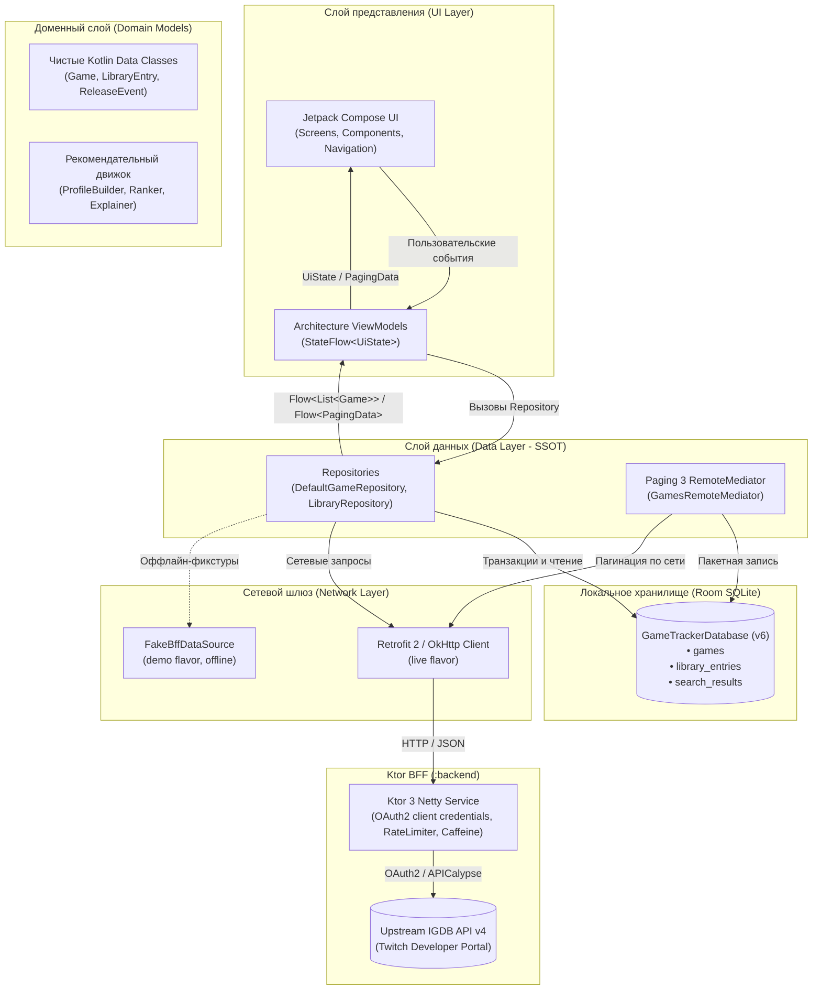
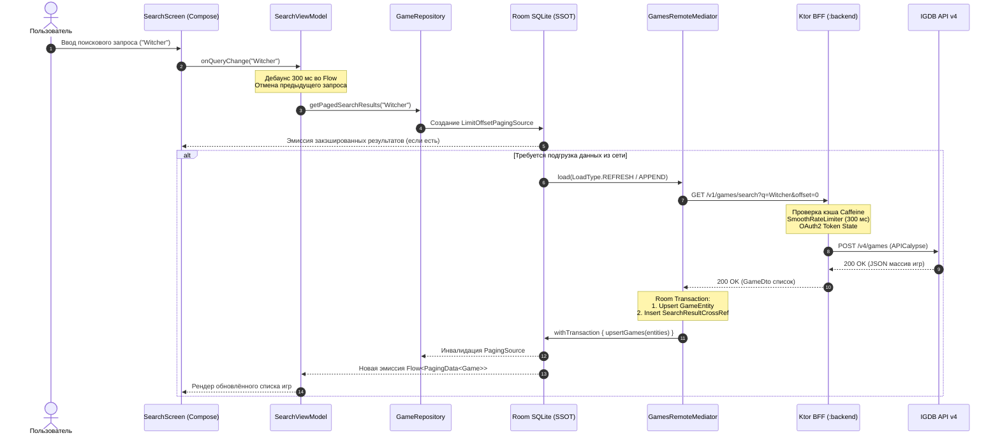

# Архитектура GameTracker

Техническое руководство по архитектуре, модели данных, реактивным потокам и границам подсистем мобильного приложения GameTracker (`:app`) и BFF `:backend`.

---

## 1. Обзор архитектуры (System Overview)

GameTracker спроектирован по принципам **Unidirectional Data Flow (UDF)** и **Offline-First Room Single Source of Truth (SSOT)**.



---

## 2. Сквозной поток данных (Critical Path Sequence)

Диаграмма иллюстрирует взаимодействие компонентов при поиске и отображении каталога игр с поддержкой пагинации:



---

## 3. Принцип Room Single Source of Truth (SSOT)

В приложении действует строгое разделение ответственности между хранилищем и сетевыми вызовами:

1. **Единственный источник правды**: Уровень представления (UI) никогда не получает сырые сетевые DTO. Экран всегда наблюдает реактивные потоки `Flow<List<T>>` или `Flow<PagingData<T>>`, исходящие из локальной базы данных SQLite через репозиторий.
2. **Атомарность сетевых обновлений**: Любой сетевой ответ сначала сохраняется в транзакции Room (`withTransaction`). Только после успешной фиксации транзакции Room генерирует событие инвалидации и поставляет свежее состояние в UI.
3. **Реляционная целостность (`ForeignKey.RESTRICT`)**:
   - Пользовательские записи в библиотеке (`library_entries`) ссылаются на каталог игр (`games`) с внешним ключом `ForeignKey.RESTRICT`.
   - Это гарантирует, что даже при очистке кэша поиска или обновлении чартов сохранённые пользователем игры и их прогресс не будут удалены каскадом.
4. **Схема и миграции**:
   - Текущая версия базы данных: `v6`.
   - Все переходы (`1→2→3→4→5→6`) покрыты детерминированными миграциями без использования `fallbackToDestructiveMigration()`.
   - Корректность структуры схемы верифицируется автотестами `MigrationTest` с проверкой хэшей схем `N.json`.

---

## 4. Разделение моделей (Model Layering)

Проект строго разделяет модели по трём изолированным уровням:

| Уровень | Тип модели | Расположение | Особенности |
| :--- | :--- | :--- | :--- |
| **Network** | `*Dto` | `core/network/model` | Сериализуемые DTO (`kotlinx.serialization`). Содержат сырые типы API IGDB, nullable поля, специфичные для транспорта структуры. Инкапсулированы внутри network/data implementation и не экспонируются через публичные контракты репозиториев в UI/ViewModel. |
| **Database** | `*Entity`, `*CrossRef` | `core/database/entity` | Аннотации Room (`@Entity`, `@PrimaryKey`, `@ForeignKey`, `@Index`). Оптимизированы для реляционного хранения в SQLite. Не содержат UI-логики. |
| **Domain** | Чистые Kotlin-модели | `core/model` | Доменные классы (`Game`, `LibraryEntry`, `ReleaseEvent`). Не содержат зависимостей от Android SDK, Room или Retrofit. Потребляются экранами и ViewModels. |

Репозитории в `core/data` выполняют функции двустороннего маппинга:
- `GameDto.toEntity(): GameEntity`
- `GameEntity.toDomain(): Game`
- `LibraryEntryEntity.toDomain(game: Game): LibraryEntry`

---

## 5. Пагинация: Paging 3 и RemoteMediator

Для плавного скролла каталогов с тысячами игр используется связка `Room` + `Paging 3`:

- **`GamesRemoteMediator`**: реализует интерфейс `RemoteMediator<Int, GameEntity>`.
- **Плотные позиции (`dense ordinals`)**: записи в связующей таблице `search_results` хранят абсолютную позицию в рамках текущего поискового запроса (`position = 0, 1, 2...`). Это исключает разреженность и дублирование элементов при конкатенации страниц.
- **Оффлайн-устойчивость**: при потере интернет-соединения `RemoteMediator` возвращает `MediatorResult.Error`, при этом уже закэшированные в Room элементы продолжают отдаваться пользователю из локальной базы данных без блокировки интерфейса.

---

## 6. Организация кода и границы модулей

Проект использует структуру **Package-by-Feature / Package-by-Layer** внутри основного модуля `:app`:

```
app/src/main/java/io/github/typenil/gametracker/
├── core/
│   ├── common/         # Dispatcher qualifiers (@IoDispatcher, @DefaultDispatcher)
│   ├── designsystem/   # Material 3 токены, цветовая палитра, типографика, атомные компоненты
│   ├── model/          # Чистые доменные модели и рекомендательный движок
│   ├── database/       # Room DB, сущности, DAO, миграции схемы v1..v6
│   ├── network/        # Retrofit интерфейсы, DTO, интерцепторы, флейворные источники
│   └── data/           # Репозитории, RemoteMediator, координация кэша
├── feature/
│   ├── discover/       # Экран рекомендаций, чарты, предстоящие релизы
│   ├── search/         # Поиск по каталогу в реальном времени с чипами фильтрации
│   ├── details/        # Детальная карточка игры, галерея, похожие игры, просмотрщик скриншотов
│   ├── library/        # Библиотека пользователя, трекинг часов, заметки, статусы
│   └── settings/       # Настройки приложения, уведомления, о проекте
└── navigation/         # AppNavHost, типизированные маршруты Navigation 2.8+
```

### Особенности и компромиссы выбранного подхода:
1. **Эффективность сборки**: Единый модуль `:app` ускоряет инкрементальную компиляцию и исключает накладные расходы Gradle на конфигурацию десятка подпроектов.
2. **Границы слоёв**: Разделение ответственности поддерживается соглашениями о структуре пакетов, чистыми интерфейсами и code review. Поскольку компилятор в рамках единого модуля не изолирует package-private видимость между слоями, дисциплина границ соблюдается архитектурными правилами проекта.

---

## 7. Кэширование и защита квот в BFF (:backend)

Микросервис Backend-for-Frontend использует многоуровневую стратегию кэширования и защиты апстрим-квот IGDB API v4:

1. **In-Memory кэш Caffeine (`BffCache`)**:
   - Каждый регион кэша изолирован и строго ограничен лимитом в **1 000 записей** (`MAX_CACHE_SIZE`).
   - Политики времени жизни (`CachePolicy`):
     - `POPULAR`: TTL 60 минут (чарты и списки популярных игр меняются редко).
     - `SEARCH`: TTL 15 минут (баланс между свежестью поисковой выдачи и поглощением повторных запросов).
     - `GAME_DETAILS`: TTL 120 минут (детальные данные об игре практически неизменны после релиза).
     - `RECOMMEND`: TTL 15 минут (персональный пул кандидатов привязан к предпочтениям пользователя).
   - **Ограничение по количеству записей (Entry-Count Limit)**: Лимит задан в виде количества записей, а не теоретической оценки heap (отсутствуют фиктивные гарантии worst-case в байтах). Фактический объем retained heap зависит от глубины графа объектов и размера DTO ответов IGDB и подлежит профилированию под максимальной продуктовой нагрузкой.
   - **Single-Flight защита**: Конкурентные запросы с одинаковым ключом объединяются (`pendingComputations` на базе `CompletableDeferred`), предотвращая лавинообразные запросы к IGDB (thundering herd).

2. **Мониторинг кэша (`GET /health/cache`)**:
   Метрики кэша экспонируются через эндпоинт `/health/cache` для мониторинга попаданий, промахов и вытеснений:
   ```bash
   curl http://127.0.0.1:8080/health/cache
   ```
   Пример ответа:
   ```json
   {
     "regions": [
       { "policy": "POPULAR", "estimatedSize": 1, "hitCount": 10, "missCount": 1, "evictionCount": 0 },
       { "policy": "SEARCH", "estimatedSize": 4, "hitCount": 15, "missCount": 4, "evictionCount": 0 },
       { "policy": "GAME_DETAILS", "estimatedSize": 12, "hitCount": 45, "missCount": 12, "evictionCount": 0 },
       { "policy": "RECOMMEND", "estimatedSize": 2, "hitCount": 8, "missCount": 2, "evictionCount": 0 }
     ]
   }
   ```
