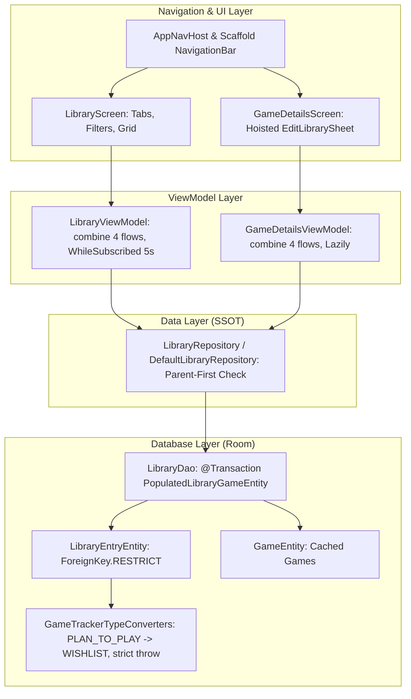

# Library Feature (9.2) Implementation Plan (Revised)

> **For agentic workers:** REQUIRED SUB-SKILL: Use superpowers:subagent-driven-development to implement this plan task-by-task. Steps use checkbox (`- [ ]`) syntax for tracking.

**Goal:** Implement the full-featured, offline-first User Library (9.2) enabling game tracking across 5 statuses (`Wishlist`, `Playing`, `Completed`, `Dropped`, `Not interested`), user ratings 1–10, favorites, notes, hours played, rich filtering/sorting, Details screen bottom sheet editor, and bottom navigation.

**Architecture:** Reactive Single Source of Truth (SSOT) via Room Database, exposed through `LibraryRepository` with parent-first `ForeignKey.RESTRICT` validation, transformed declaratively in `LibraryViewModel` using `combine`, and presented with Material 3 Jetpack Compose UI (Scaffold-coordinated Bottom Navigation, TabRow with dynamic counters, adaptive 2-column grid, dedicated 1–10 rating indicator, and hoisted ModalBottomSheet editor).

**Architecture Diagram:**



**Tech Stack:** Kotlin 2.2, Jetpack Compose Material 3, Room 2.6.1, Navigation Compose 2.8.9, Hilt 2.60.1, Coroutines & Flow, Turbine, MockK, JUnit 4.

## Global Constraints

- **No Room schema bump**: Remains v3 (enums stored as TEXT, no new columns, `3.json` unchanged).
- **Room SSOT & Parent-First**: `LibraryRepository` validates `GameEntity` exists before `library_entries` upsert to uphold `ForeignKey.RESTRICT`.
- **Combine cleanliness**: In ViewModels, group local state flags into data class container (`combine` $\le 4$ flows). Never read `uiState.value` imperatively.
- **Rating scale safety**: Dedicated 1–10 indicator for user ratings; do not reuse 0–100 critic `RatingBadge`.
- **UI Clickable hierarchy**: Non-interactive status surface in cards; no clickable items inside clickable cards.
- **Navigation placement**: `AppNavHost` coordinates `Scaffold` and `NavigationBar`. Bottom bar is visible ONLY on `DiscoverKey` and `LibraryKey` (hidden on Search and GameDetails). `MainActivity.kt` remains untouched.
- **Tab `ALL` semantics**: Includes `PLAYING`, `WISHLIST`, `COMPLETED`, `DROPPED` (excludes `NOT_INTERESTED`).
- **PR Decomposition**: Plan is split into 2 deliverable PR slices.

---

## Slice 1: Data Layer & Details Integration (PR 1)

### Task 1: Domain Models & TypeConverters Update

**Files:**
- Modify: `app/src/main/java/io/github/typenil/gametracker/core/model/LibraryStatus.kt`
- Create: `app/src/main/java/io/github/typenil/gametracker/core/model/LibraryGame.kt`
- Modify: `app/src/main/java/io/github/typenil/gametracker/core/database/converter/GameTrackerTypeConverters.kt`
- Test: `app/src/test/java/io/github/typenil/gametracker/core/database/converter/GameTrackerTypeConvertersTest.kt`

**Interfaces:**
- Produces: `LibraryStatus` (`PLAYING`, `WISHLIST`, `COMPLETED`, `DROPPED`, `NOT_INTERESTED`), `LibraryGame(val game: Game, val entry: LibraryEntry)`

- [ ] **Step 1: Write failing unit tests for TypeConverter strict decoding and backward compatibility**

```kotlin
package io.github.typenil.gametracker.core.database.converter

import io.github.typenil.gametracker.core.model.LibraryStatus
import org.junit.Assert.assertEquals
import org.junit.Assert.assertNull
import org.junit.Test

class GameTrackerTypeConvertersTest {

    private val converters = GameTrackerTypeConverters()

    @Test
    fun toLibraryStatus_mapsPlanToPlayToWishlist() {
        assertEquals(LibraryStatus.WISHLIST, converters.toLibraryStatus("PLAN_TO_PLAY"))
    }

    @Test
    fun toLibraryStatus_mapsNewStatusesCorrectly() {
        assertEquals(LibraryStatus.WISHLIST, converters.toLibraryStatus("WISHLIST"))
        assertEquals(LibraryStatus.NOT_INTERESTED, converters.toLibraryStatus("NOT_INTERESTED"))
        assertEquals(LibraryStatus.PLAYING, converters.toLibraryStatus("PLAYING"))
        assertEquals(LibraryStatus.COMPLETED, converters.toLibraryStatus("COMPLETED"))
        assertEquals(LibraryStatus.DROPPED, converters.toLibraryStatus("DROPPED"))
        assertNull(converters.toLibraryStatus(null))
        assertNull(converters.toLibraryStatus(""))
    }

    @Test(expected = IllegalArgumentException::class)
    fun toLibraryStatus_throwsOnUnknownStatus() {
        converters.toLibraryStatus("INVALID_STATUS_NAME")
    }

    @Test
    fun fromLibraryStatus_serializesExactEnumName() {
        assertEquals("WISHLIST", converters.fromLibraryStatus(LibraryStatus.WISHLIST))
        assertEquals("NOT_INTERESTED", converters.fromLibraryStatus(LibraryStatus.NOT_INTERESTED))
        assertNull(converters.fromLibraryStatus(null))
    }
}
```

- [ ] **Step 2: Run test to verify it fails**

Run: `.\gradlew.bat :app:testDemoDebugUnitTest --tests "io.github.typenil.gametracker.core.database.converter.GameTrackerTypeConvertersTest"`
Expected: FAIL.

- [ ] **Step 3: Update `LibraryStatus.kt`, `LibraryGame.kt`, and `GameTrackerTypeConverters.kt`**

In `LibraryStatus.kt`:
```kotlin
package io.github.typenil.gametracker.core.model

/**
 * Status of a game in the user's personal library.
 */
enum class LibraryStatus {
    PLAYING,
    WISHLIST,
    COMPLETED,
    DROPPED,
    NOT_INTERESTED
}
```

In `LibraryGame.kt`:
```kotlin
package io.github.typenil.gametracker.core.model

/**
 * Composite domain model combining game metadata with personal library entry.
 */
data class LibraryGame(
    val game: Game,
    val entry: LibraryEntry
)
```

In `GameTrackerTypeConverters.kt`:
```kotlin
    @TypeConverter
    fun fromLibraryStatus(status: LibraryStatus?): String? {
        return status?.name
    }

    @TypeConverter
    fun toLibraryStatus(value: String?): LibraryStatus? {
        if (value.isNullOrBlank()) return null
        if (value == "PLAN_TO_PLAY") return LibraryStatus.WISHLIST
        return LibraryStatus.valueOf(value)
    }
```

- [ ] **Step 4: Run test to verify it passes**

Run: `.\gradlew.bat :app:testDemoDebugUnitTest --tests "io.github.typenil.gametracker.core.database.converter.GameTrackerTypeConvertersTest"`
Expected: PASS.

- [ ] **Step 5: Commit changes**

```bash
git add app/src/main/java/io/github/typenil/gametracker/core/model/ app/src/main/java/io/github/typenil/gametracker/core/database/converter/ app/src/test/java/io/github/typenil/gametracker/core/database/converter/
git commit -m "feat(domain): add WISHLIST and NOT_INTERESTED to LibraryStatus with strict backward-compatible converters"
```

---

### Task 2: Room Database Populated Relation & LibraryDao Queries

**Files:**
- Create: `app/src/main/java/io/github/typenil/gametracker/core/database/entity/PopulatedLibraryGameEntity.kt`
- Modify: `app/src/main/java/io/github/typenil/gametracker/core/database/dao/LibraryDao.kt`
- Modify: `app/src/main/java/io/github/typenil/gametracker/core/database/mapper/EntityMappers.kt`
- Modify: `app/src/androidTest/java/io/github/typenil/gametracker/core/database/LibraryDaoTest.kt`

**Interfaces:**
- Produces: `PopulatedLibraryGameEntity`, `LibraryDao.getPopulatedLibraryEntriesFlow()`, `PopulatedLibraryGameEntity.toDomain(): LibraryGame`

- [ ] **Step 1: Create `PopulatedLibraryGameEntity.kt`**

```kotlin
package io.github.typenil.gametracker.core.database.entity

import androidx.room.Embedded
import androidx.room.Relation

/**
 * Relational model uniting a library entry with its parent game row.
 */
data class PopulatedLibraryGameEntity(
    @Embedded
    val entry: LibraryEntryEntity,

    @Relation(
        parentColumn = "gameId",
        entityColumn = "id"
    )
    val game: GameEntity
)
```

- [ ] **Step 2: Update `LibraryDao.kt`**

```kotlin
    @androidx.room.Transaction
    @Query("SELECT * FROM library_entries ORDER BY updatedAtEpochSeconds DESC")
    fun getPopulatedLibraryEntriesFlow(): Flow<List<PopulatedLibraryGameEntity>>
```

- [ ] **Step 3: Update `EntityMappers.kt`**

```kotlin
fun PopulatedLibraryGameEntity.toDomain(): LibraryGame = LibraryGame(
    game = game.toDomain(),
    entry = entry.toDomain()
)
```

- [ ] **Step 4: Update `LibraryDaoTest.kt` for populated relation and raw SQL PLAN_TO_PLAY compatibility**

```kotlin
    @Test
    fun getPopulatedLibraryEntriesFlow_emitsJoinedGameAndEntry() = runTest {
        val game = GameEntity(101L, "Elden Ring", null, 95.0, 95.0, 1000, emptyList(), emptyList(), 100L)
        gameDao.upsertGame(game)

        val entry = LibraryEntryEntity(
            gameId = 101L,
            status = LibraryStatus.WISHLIST,
            userRating = 9,
            addedAtEpochSeconds = 1000L,
            updatedAtEpochSeconds = 1000L
        )
        libraryDao.upsertLibraryEntry(entry)

        val populated = libraryDao.getPopulatedLibraryEntriesFlow().first()
        assertEquals(1, populated.size)
        assertEquals("Elden Ring", populated[0].game.name)
        assertEquals(LibraryStatus.WISHLIST, populated[0].entry.status)
        assertEquals(9, populated[0].entry.userRating)
    }

    @Test
    fun rawSqlPlanToPlay_deserializesAsWishlist() = runTest {
        val game = GameEntity(102L, "Bloodborne", null, null, null, null, emptyList(), emptyList(), 100L)
        gameDao.upsertGame(game)

        database.openHelper.writableDatabase.execSQL(
            "INSERT INTO library_entries (gameId, status, addedAtEpochSeconds, updatedAtEpochSeconds, isFavorite, hoursPlayed) VALUES (102, 'PLAN_TO_PLAY', 100, 100, 0, 0)"
        )

        val entry = libraryDao.getLibraryEntry(102L)
        assertNotNull(entry)
        assertEquals(LibraryStatus.WISHLIST, entry?.status)
    }
```

- [ ] **Step 5: Verify build & tests**

Run: `.\gradlew.bat :app:compileDemoDebugKotlin`
Expected: Exit 0.

- [ ] **Step 6: Commit changes**

```bash
git add app/src/main/java/io/github/typenil/gametracker/core/database/ app/src/androidTest/java/io/github/typenil/gametracker/core/database/
git commit -m "feat(database): add PopulatedLibraryGameEntity and getPopulatedLibraryEntriesFlow to LibraryDao"
```

---

### Task 3: Data Layer — `LibraryRepository` with Parent-First Validation

**Files:**
- Create: `app/src/main/java/io/github/typenil/gametracker/core/data/repository/LibraryRepository.kt`
- Create: `app/src/main/java/io/github/typenil/gametracker/core/data/repository/DefaultLibraryRepository.kt`
- Modify: `app/src/main/java/io/github/typenil/gametracker/core/data/di/DataModule.kt`
- Create: `app/src/test/java/io/github/typenil/gametracker/core/data/DefaultLibraryRepositoryTest.kt`

**Interfaces:**
- Produces: `LibraryRepository` interface & `DefaultLibraryRepository` implementation.

- [ ] **Step 1: Write failing unit test for `DefaultLibraryRepository` verifying parent-first RESTRICT check**

```kotlin
package io.github.typenil.gametracker.core.data

import app.cash.turbine.test
import io.github.typenil.gametracker.core.data.repository.DefaultLibraryRepository
import io.github.typenil.gametracker.core.database.dao.GameDao
import io.github.typenil.gametracker.core.database.dao.LibraryDao
import io.github.typenil.gametracker.core.database.entity.GameEntity
import io.github.typenil.gametracker.core.database.entity.LibraryEntryEntity
import io.github.typenil.gametracker.core.database.entity.PopulatedLibraryGameEntity
import io.github.typenil.gametracker.core.model.AppResult
import io.github.typenil.gametracker.core.model.LibraryEntry
import io.github.typenil.gametracker.core.model.LibraryStatus
import io.mockk.coEvery
import io.mockk.coVerify
import io.mockk.every
import io.mockk.mockk
import kotlinx.coroutines.flow.flowOf
import kotlinx.coroutines.test.StandardTestDispatcher
import kotlinx.coroutines.test.runTest
import org.junit.Assert.assertEquals
import org.junit.Assert.assertTrue
import org.junit.Test

class DefaultLibraryRepositoryTest {

    private val libraryDao: LibraryDao = mockk(relaxed = true)
    private val gameDao: GameDao = mockk(relaxed = true)
    private val testDispatcher = StandardTestDispatcher()
    private val repository = DefaultLibraryRepository(libraryDao, gameDao, testDispatcher)

    @Test
    fun getLibraryGamesFlow_mapsEntitiesToDomain() = runTest(testDispatcher) {
        val gameEntity = GameEntity(1L, "Hades", null, 93.0, 93.0, 500, listOf("Action"), listOf("PC"), 100L)
        val entryEntity = LibraryEntryEntity(1L, LibraryStatus.PLAYING, 10, "Great game", true, 1000L, 1000L, 25)
        val populated = PopulatedLibraryGameEntity(entry = entryEntity, game = gameEntity)

        every { libraryDao.getPopulatedLibraryEntriesFlow() } returns flowOf(listOf(populated))

        repository.getLibraryGamesFlow().test {
            val games = awaitItem()
            assertEquals(1, games.size)
            assertEquals("Hades", games[0].game.name)
            assertEquals(LibraryStatus.PLAYING, games[0].entry.status)
            assertEquals(10, games[0].entry.userRating)
            awaitComplete()
        }
    }

    @Test
    fun saveLibraryEntry_withoutParentGame_returnsError() = runTest(testDispatcher) {
        coEvery { gameDao.getGameById(999L) } returns null

        val entry = LibraryEntry(
            gameId = 999L,
            status = LibraryStatus.COMPLETED,
            addedAtEpochSeconds = 100L,
            updatedAtEpochSeconds = 100L
        )

        val result = repository.saveLibraryEntry(entry)
        assertTrue("Expected Error when parent game is missing", result is AppResult.Error)
        coVerify(exactly = 0) { libraryDao.upsertLibraryEntry(any()) }
    }

    @Test
    fun saveLibraryEntry_withParentGame_upsertsSuccessfully() = runTest(testDispatcher) {
        coEvery { gameDao.getGameById(42L) } returns GameEntity(42L, "G", null, null, null, null, emptyList(), emptyList(), 1L)
        coEvery { libraryDao.upsertLibraryEntry(any()) } returns 1L

        val entry = LibraryEntry(
            gameId = 42L,
            status = LibraryStatus.COMPLETED,
            userRating = 10,
            userNotes = "Masterpiece",
            isFavorite = true,
            addedAtEpochSeconds = 100L,
            updatedAtEpochSeconds = 100L,
            hoursPlayed = 60
        )

        val result = repository.saveLibraryEntry(entry)
        assertTrue("Expected Success when parent game exists", result is AppResult.Success)
        coVerify { libraryDao.upsertLibraryEntry(match { it.gameId == 42L && it.status == LibraryStatus.COMPLETED }) }
    }
}
```

- [ ] **Step 2: Run test to verify it fails**

Run: `.\gradlew.bat :app:testDemoDebugUnitTest --tests "io.github.typenil.gametracker.core.data.DefaultLibraryRepositoryTest"`
Expected: FAIL.

- [ ] **Step 3: Implement `LibraryRepository.kt` and `DefaultLibraryRepository.kt`**

In `LibraryRepository.kt`:
```kotlin
package io.github.typenil.gametracker.core.data.repository

import io.github.typenil.gametracker.core.model.AppResult
import io.github.typenil.gametracker.core.model.LibraryEntry
import io.github.typenil.gametracker.core.model.LibraryGame
import io.github.typenil.gametracker.core.model.LibraryStatus
import kotlinx.coroutines.flow.Flow

/**
 * Repository interface for managing user's personal game library records.
 */
interface LibraryRepository {
    fun getLibraryGamesFlow(): Flow<List<LibraryGame>>
    fun getLibraryEntryFlow(gameId: Long): Flow<LibraryEntry?>
    suspend fun setGameStatus(gameId: Long, status: LibraryStatus): AppResult<Unit>
    suspend fun saveLibraryEntry(entry: LibraryEntry): AppResult<Unit>
    suspend fun removeGameFromLibrary(gameId: Long): AppResult<Unit>
}
```

In `DefaultLibraryRepository.kt`:
```kotlin
package io.github.typenil.gametracker.core.data.repository

import io.github.typenil.gametracker.core.common.IoDispatcher
import io.github.typenil.gametracker.core.common.runSuspendCatching
import io.github.typenil.gametracker.core.database.dao.GameDao
import io.github.typenil.gametracker.core.database.dao.LibraryDao
import io.github.typenil.gametracker.core.database.mapper.toDomain
import io.github.typenil.gametracker.core.database.mapper.toEntity
import io.github.typenil.gametracker.core.model.AppError
import io.github.typenil.gametracker.core.model.AppResult
import io.github.typenil.gametracker.core.model.LibraryEntry
import io.github.typenil.gametracker.core.model.LibraryGame
import io.github.typenil.gametracker.core.model.LibraryStatus
import kotlinx.coroutines.CoroutineDispatcher
import kotlinx.coroutines.flow.Flow
import kotlinx.coroutines.flow.flowOn
import kotlinx.coroutines.flow.map
import kotlinx.coroutines.withContext
import javax.inject.Inject

class DefaultLibraryRepository @Inject constructor(
    private val libraryDao: LibraryDao,
    private val gameDao: GameDao,
    @IoDispatcher private val ioDispatcher: CoroutineDispatcher
) : LibraryRepository {

    override fun getLibraryGamesFlow(): Flow<List<LibraryGame>> =
        libraryDao.getPopulatedLibraryEntriesFlow()
            .map { list -> list.map { it.toDomain() } }
            .flowOn(ioDispatcher)

    override fun getLibraryEntryFlow(gameId: Long): Flow<LibraryEntry?> =
        libraryDao.getLibraryEntryFlow(gameId)
            .map { it?.toDomain() }
            .flowOn(ioDispatcher)

    override suspend fun setGameStatus(gameId: Long, status: LibraryStatus): AppResult<Unit> =
        withContext(ioDispatcher) {
            runSuspendCatching {
                val game = gameDao.getGameById(gameId)
                    ?: return@runSuspendCatching AppResult.Error(
                        AppError.Database("Parent game $gameId must exist before updating library")
                    )
                val now = System.currentTimeMillis() / 1000
                val existing = libraryDao.getLibraryEntry(gameId)
                val updated = if (existing != null) {
                    existing.copy(status = status, updatedAtEpochSeconds = now)
                } else {
                    LibraryEntry(
                        gameId = gameId,
                        status = status,
                        addedAtEpochSeconds = now,
                        updatedAtEpochSeconds = now
                    ).toEntity()
                }
                libraryDao.upsertLibraryEntry(updated)
                AppResult.Success(Unit)
            }.getOrElse { AppResult.Error(AppError.Database(it.message ?: "Database error")) }
        }

    override suspend fun saveLibraryEntry(entry: LibraryEntry): AppResult<Unit> =
        withContext(ioDispatcher) {
            runSuspendCatching {
                val game = gameDao.getGameById(entry.gameId)
                    ?: return@runSuspendCatching AppResult.Error(
                        AppError.Database("Parent game ${entry.gameId} must exist before updating library")
                    )
                val now = System.currentTimeMillis() / 1000
                val clampedRating = entry.userRating?.coerceIn(1, 10)
                val clampedHours = entry.hoursPlayed.coerceAtLeast(0)
                val sanitizedNotes = entry.userNotes?.let { notes ->
                    if (notes.codePointCount(0, notes.length) > MAX_NOTES_CODE_POINTS) {
                        val endIdx = notes.offsetByCodePoints(0, MAX_NOTES_CODE_POINTS)
                        notes.substring(0, endIdx)
                    } else {
                        notes
                    }
                }
                val entity = entry.copy(
                    userRating = clampedRating,
                    hoursPlayed = clampedHours,
                    userNotes = sanitizedNotes,
                    updatedAtEpochSeconds = now
                ).toEntity()
                libraryDao.upsertLibraryEntry(entity)
                AppResult.Success(Unit)
            }.getOrElse { AppResult.Error(AppError.Database(it.message ?: "Database error")) }
        }

    override suspend fun removeGameFromLibrary(gameId: Long): AppResult<Unit> =
        withContext(ioDispatcher) {
            runSuspendCatching {
                libraryDao.deleteLibraryEntry(gameId)
                AppResult.Success(Unit)
            }.getOrElse { AppResult.Error(AppError.Database(it.message ?: "Database error")) }
        }

    companion object {
        const val MAX_NOTES_CODE_POINTS = 500
    }
}
```

In `DataModule.kt`: Bind `LibraryRepository` to `DefaultLibraryRepository`.

- [ ] **Step 4: Run test to verify it passes**

Run: `.\gradlew.bat :app:testDemoDebugUnitTest --tests "io.github.typenil.gametracker.core.data.DefaultLibraryRepositoryTest"`
Expected: PASS.

- [ ] **Step 5: Commit changes**

```bash
git add app/src/main/java/io/github/typenil/gametracker/core/data/ app/src/test/java/io/github/typenil/gametracker/core/data/
git commit -m "feat(data): implement LibraryRepository with parent-first RESTRICT validation"
```

---

### Task 4: Feature Game Details — Library Status & Hoisted ModalBottomSheet Editor

**Files:**
- Create: `app/src/main/java/io/github/typenil/gametracker/feature/details/component/EditLibrarySheet.kt`
- Modify: `app/src/main/java/io/github/typenil/gametracker/feature/details/GameDetailsUiState.kt`
- Modify: `app/src/main/java/io/github/typenil/gametracker/feature/details/GameDetailsViewModel.kt`
- Modify: `app/src/main/java/io/github/typenil/gametracker/feature/details/GameDetailsScreen.kt`
- Modify: `app/src/test/java/io/github/typenil/gametracker/feature/details/GameDetailsViewModelTest.kt`

**Interfaces:**
- Produces: `GameDetailsUiState.libraryEntry`, `GameDetailsViewModel.saveLibraryEntry(...)`, `GameDetailsViewModel.removeLibraryEntry()`, hoisted `EditLibrarySheet` Composable.

- [ ] **Step 1: Refactor `GameDetailsUiState.kt` and `GameDetailsViewModel.kt` for 4-flow combine**

In `GameDetailsUiState.kt`:
```kotlin
data class DetailsInternalFlags(
    val isLoading: Boolean = true,
    val isRefreshing: Boolean = false,
    val isEditingLibrary: Boolean = false,
    val message: Pair<AppError?, Int?>? = null
)

data class GameDetailsUiState(
    val game: GameDetails? = null,
    val libraryEntry: LibraryEntry? = null,
    val isHydrated: Boolean = false,
    val isLoading: Boolean = false,
    val isRefreshing: Boolean = false,
    val isEditingLibrary: Boolean = false,
    val error: AppError? = null,
    @StringRes val userMessageRes: Int? = null
)
```

In `GameDetailsViewModel.kt`:
```kotlin
    private val _flags = MutableStateFlow(DetailsInternalFlags())

    val uiState: StateFlow<GameDetailsUiState> = combine(
        gameRepository.getGameDetailsFlow(gameId),
        gameRepository.isGameDetailsHydratedFlow(gameId),
        libraryRepository.getLibraryEntryFlow(gameId),
        _flags
    ) { game, isHydrated, libraryEntry, flags ->
        val error = flags.message?.first
        GameDetailsUiState(
            game = game,
            libraryEntry = libraryEntry,
            isHydrated = isHydrated,
            isLoading = flags.isLoading,
            isRefreshing = flags.isRefreshing,
            isEditingLibrary = flags.isEditingLibrary,
            error = if (game != null) null else error,
            userMessageRes = if (game != null && error != null) {
                flags.message?.second ?: R.string.error_refresh_failed
            } else {
                flags.message?.second
            }
        )
    }.stateIn(
        scope = viewModelScope,
        started = SharingStarted.Lazily,
        initialValue = GameDetailsUiState(isLoading = true)
    )
```

Add methods:
`fun onEditLibraryClicked()` -> sets `isEditingLibrary = true`.
`fun onDismissEditLibrary()` -> sets `isEditingLibrary = false`.
`fun onSaveLibraryEntry(status: LibraryStatus, rating: Int?, hours: Int, notes: String?, isFavorite: Boolean)`: saves via `libraryRepository.saveLibraryEntry(...)`. Note: does not mutate `_flags.isRefreshing`.
`fun onRemoveFromLibrary()`: removes via `libraryRepository.removeGameFromLibrary(gameId)`.

- [ ] **Step 2: Implement `EditLibrarySheet.kt`**

Hoisted Material 3 `ModalBottomSheet` containing:
- Status Filter Chips (`Wishlist`, `Playing`, `Completed`, `Dropped`, `Not interested`)
- User Rating 1–10 interactive buttons / bar
- Hours played stepper
- Favorite toggle switch
- Notes text field
- Save and Remove actions

- [ ] **Step 3: Update `GameDetailsScreen.kt` to place `EditLibrarySheet` at content root**

Outside of `LazyColumn` (at root `Box`), conditionally render `EditLibrarySheet` when `uiState.isEditingLibrary` is true.
Inside `GameDetailsScreen`, render interactive Library Status Card / Button.

- [ ] **Step 4: Update `GameDetailsViewModelTest.kt` with FakeLibraryRepository**

- [ ] **Step 5: Run unit tests**

Run: `.\gradlew.bat :app:testDemoDebugUnitTest --tests "io.github.typenil.gametracker.feature.details.GameDetailsViewModelTest"`
Expected: PASS.

- [ ] **Step 6: Commit changes**

```bash
git add app/src/main/java/io/github/typenil/gametracker/feature/details/ app/src/test/java/io/github/typenil/gametracker/feature/details/
git commit -m "feat(details): add library status action and hoisted EditLibrarySheet to GameDetailsScreen"
```

---

## Slice 2: Library Screen & Bottom Navigation (PR 2)

### Task 5: Feature Library — UI State, ViewModel, and Screen

**Files:**
- Create: `app/src/main/java/io/github/typenil/gametracker/feature/library/LibraryTab.kt`
- Create: `app/src/main/java/io/github/typenil/gametracker/feature/library/LibrarySortOption.kt`
- Create: `app/src/main/java/io/github/typenil/gametracker/feature/library/LibraryUiState.kt`
- Create: `app/src/main/java/io/github/typenil/gametracker/feature/library/LibraryViewModel.kt`
- Create: `app/src/main/java/io/github/typenil/gametracker/feature/library/LibraryScreen.kt`
- Create: `app/src/main/java/io/github/typenil/gametracker/feature/library/component/LibraryGameCard.kt`
- Create: `app/src/main/java/io/github/typenil/gametracker/feature/library/component/UserRatingBadge.kt`
- Create: `app/src/main/java/io/github/typenil/gametracker/feature/library/navigation/LibraryKey.kt`
- Create: `app/src/main/java/io/github/typenil/gametracker/feature/library/navigation/LibraryEntry.kt`
- Create: `app/src/test/java/io/github/typenil/gametracker/feature/library/LibraryViewModelTest.kt`

**Interfaces:**
- Produces: `LibraryScreen`, `LibraryViewModel`, `LibraryKey`, `libraryEntry`

- [ ] **Step 1: Write `LibraryViewModelTest.kt`**

Testing:
- `ALL` tab aggregates `PLAYING`, `WISHLIST`, `COMPLETED`, `DROPPED` and excludes `NOT_INTERESTED`.
- `NOT_INTERESTED` tab shows only not interested games.
- Favorite filter chip filters within selected tab.
- In-memory query search filters titles instantly.
- Sorting options (`UPDATED_DESC`, `USER_RATING_DESC`, `TITLE_ASC`, `HOURS_PLAYED_DESC`).

- [ ] **Step 2: Run test to verify it fails**

Run: `.\gradlew.bat :app:testDemoDebugUnitTest --tests "io.github.typenil.gametracker.feature.library.LibraryViewModelTest"`
Expected: FAIL.

- [ ] **Step 3: Implement `LibraryTab.kt`, `LibrarySortOption.kt`, `LibraryUiState.kt`, `LibraryViewModel.kt`**

In `LibraryViewModel.kt`:
Use `combine(libraryRepository.getLibraryGamesFlow(), _filterState)` with `stateIn(viewModelScope, SharingStarted.WhileSubscribed(5_000), ...)`.

- [ ] **Step 4: Implement `UserRatingBadge.kt`, `LibraryGameCard.kt`, and `LibraryScreen.kt`**

- `UserRatingBadge`: renders 1–10 formatted label (`"★ 9/10"`).
- `LibraryGameCard`: `Card(onClick = onGameClick)` with non-interactive status `Surface` pill. No clickable `IconButton` inside `Card`.
- `LibraryScreen`: `ScrollableTabRow` with badges, favorites filter chip, TopAppBar with search toggle and sort dropdown, adaptive 2-column `LazyVerticalGrid`, empty state.

- [ ] **Step 5: Run unit tests**

Run: `.\gradlew.bat :app:testDemoDebugUnitTest --tests "io.github.typenil.gametracker.feature.library.LibraryViewModelTest"`
Expected: PASS.

- [ ] **Step 6: Commit changes**

```bash
git add app/src/main/java/io/github/typenil/gametracker/feature/library/ app/src/test/java/io/github/typenil/gametracker/feature/library/
git commit -m "feat(library): implement LibraryScreen, ViewModel, sorting, filtering, and 1-10 rating badge"
```

---

### Task 6: Global Navigation Coordination (Bottom Navigation Bar)

**Files:**
- Modify: `app/src/main/java/io/github/typenil/gametracker/navigation/AppNavigation.kt`

- [ ] **Step 1: Update `AppNavHost` in `AppNavigation.kt`**

Wrap `NavHost` inside a `Scaffold` with `NavigationBar`:
- Determine current destination via `navController.currentBackStackEntryAsState()`.
- Bottom bar is rendered **only** when destination is `DiscoverKey` or `LibraryKey`.
- Tab navigation uses:
  ```kotlin
  navController.navigate(targetKey) {
      popUpTo(DiscoverKey) { saveState = true }
      launchSingleTop = true
      restoreState = true
  }
  ```
- Search from Library navigates to `SearchKey` via `navigateToSearch()`.

- [ ] **Step 2: Run full verification suite**

Run:
```bash
.\gradlew.bat :app:detekt
.\gradlew.bat :app:testDemoDebugUnitTest
.\gradlew.bat assembleDemoDebug
.\gradlew.bat assembleLiveDebug
```
Expected: All exit 0.

- [ ] **Step 3: Commit navigation coordination**

```bash
git add app/src/main/java/io/github/typenil/gametracker/navigation/
git commit -m "feat(navigation): add Bottom Navigation Bar for Discover and Library in AppNavHost"
```

---

## Verification Plan

### Automated Tests
```bash
# TypeConverter & Repository Unit Tests
.\gradlew.bat :app:testDemoDebugUnitTest --tests "io.github.typenil.gametracker.core.database.converter.GameTrackerTypeConvertersTest"
.\gradlew.bat :app:testDemoDebugUnitTest --tests "io.github.typenil.gametracker.core.data.DefaultLibraryRepositoryTest"

# ViewModels Unit Tests
.\gradlew.bat :app:testDemoDebugUnitTest --tests "io.github.typenil.gametracker.feature.details.GameDetailsViewModelTest"
.\gradlew.bat :app:testDemoDebugUnitTest --tests "io.github.typenil.gametracker.feature.library.LibraryViewModelTest"

# Full Unit Tests & Lint
.\gradlew.bat :app:testDemoDebugUnitTest
.\gradlew.bat :app:detekt

# Assemble Demo and Live builds
.\gradlew.bat assembleDemoDebug
.\gradlew.bat assembleLiveDebug
```
